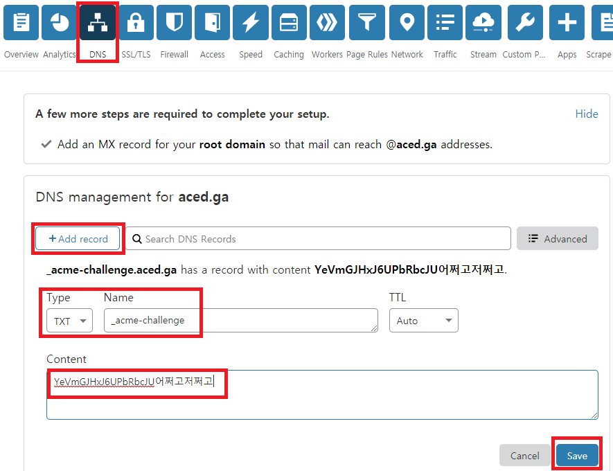
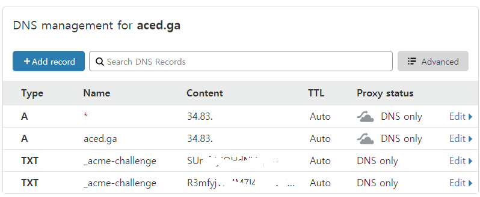

## 들어가며

보통 1개의 도메인만 발급 받는 경우가 많은데요. (예를들면 wsgvet.com 하나)

추후 확장성 및 관리의 용이성을 위해 Wildcard SSL 인증서를 받을 것입니다.

wsgvet.com와 *.wsgvet.com가 가능한거죠. 나중에 blog.wsgvet.com 라든지, bbs.wsgvet.com 모두 하나의 인증서로 SSL 연결이 가능합니다.

클라우드 플레어에서만 설정하면 바로 발급되므로 추천드립니다.

---

7월 24일 전에 와일드카드 인증서를 적용하신 분은 꼭 1번의 방법으로 다시 해주셔야 합니다. 

기존 방식으로 발급받은 경우 `certbot renew` 명령어로 갱신하면 에러가 뜹니다.

그 이유는 `manual` 방식으로 발급 받은 경우 자동 갱신이 안되기 때문입니다.

---

## 1. acme.sh를 사용한 SSL 인증서 발급받기

### (1) Freenom에서 발급 받은 무료 도메인 `ga,ml,cf,gq,tk` 을 위한 방법

아쉽게도 `Cloudflare`의 DNS API 방식으로는 발급이 불가능합니다. 따라서 `와일드카드` 인증서를 발급 받을 경우 자동 갱신이 되지 않습니다.

DNS 인증방식으로 자동 발급 및 와일드카드 인증서 자동 갱신을 위해서는

1. 무료 도메인이 아닌 유료 도메인을 구입한다.

2. `Cloudflare`가 아닌 다른 DNS 서비스를 이용한다. (<a href="http://www.luadns.com/" target="_blank" rel="noopener noreferrer">LuaDNS</a> 등)

위 2가지 방식으로 와일드카드 인증서를 발급 받을 수 있습니다.

<a href="https://www.wsgvet.com/bbs/board.php?bo_table=home&wr_id=640" target="_blank" rel="noopener noreferrer">LuaDNS API를 이용한 무료도메인 와일드카드 SSL 인증서 발급 받기</a>

위 링크를 통해서 클라우드플레어가 아닌 LusDNS를 통해 무료도메인도 와일드카드 인증서를 발급받을 수 있습니다.

webroot 방식보다 DNS 방식으로 발급 받는 것이 훨씬 편하므로 강력 추천드립니다.

---

와일드카드 인증서가 필요없는 경우 `acme.sh`를 이용하여 Webroot 방식으로 발급 받을 수 있습니다.

현재 단계에서는 발급받을 수 없고, 뒤에 이어지는 `Ghost 플랫폼`, `그누보드`, `워드프레스` 설치 후 발급 받을 수 있습니다.

해당 글에 방법을 첨부하겠습니다. 미리 보시려면

<a href="https://www.wsgvet.com/bbs/board.php?bo_table=home&wr_id=639" target="_blank" rel="noopener noreferrer">DNS 인증을 통한 acme.sh Letsencrypt SSL 인증서 발급받기</a>

위 링크에서 1번, 4번을 참조하시면 됩니다.

---

### (2) Freenom에서 발급 받지 않은 유료 도메인(.com, .net, .co.kr 등등)

<a href="https://www.wsgvet.com/bbs/board.php?bo_table=home&wr_id=639" target="_blank" rel="noopener noreferrer">DNS 인증을 통한 acme.sh Letsencrypt SSL 인증서 발급받기</a>

위 링크를 그대로 따라하시면 매우 편하게 클라우드플레어 API를 통한 와일드카드 인증서 발급 및 자동갱신을 적용할 수 있습니다.

---

## 2. letsencrypt를 통해 SSL 인증서 발급받기
### (3개월마다 수동 인증 필수이므로 추천하지 않습니다.)

인증서 발급 패키지인 certbot을 먼저 설치합니다.

    sudo apt install certbot
    

위 명령어를 넣고 y엔터 후 바로 설치됩니다.

    sudo certbot certonly --manual --preferred-challenges=dns --email youremail@email.com --server https://acme-v02.api.letsencrypt.org/directory --agree-tos -d yourdomain.com -d *.yourdomian.com
    

이제 위와 같은 형식으로 넣어주면 됩니다.

youremail@email.com은 반드시 자신의 이메일로 바꿔주시고,

yourdomain.com 도 자신의 도메인으로 바꿔주세요.

위 명령어를 자신에게 맞게 수정 후 넣으면

> Saving debug log to /var/log/letsencrypt/letsencrypt.log
> Plugins selected: Authenticator manual, Installer None

---

> Would you be willing to share your email address with the Electronic Frontier Foundation, a founding partner of the Let's Encrypt project and the non-profit organization that develops Certbot? We'd like to send you email about our work encrypting the web, EFF news, campaigns, and ways to support digital freedom.

---

> (Y)es/(N)o:

위와 같이 이메일 주소를 공유할거냐 물어보는데, 원하시면 y 엔터 누르시면 됩니다.

> Obtaining a new certificate
> Performing the following challenges:
> dns-01 challenge for aced.ga
> dns-01 challenge for aced.ga

---

> NOTE: The IP of this machine will be publicly logged as having requested this certificate. If you're running certbot in manual mode on a machine that is not your server, please ensure you're okay with that.

> Are you OK with your IP being logged?

---

> (Y)es/(N)o:

그리고 위와 같이 물어보는데 y 엔터를 누릅니다.

---

> Please deploy a DNS TXT record under the name
> _acme-challenge.aced.ga with the following value:

> YeVmGJHxJ6UPbRbcJU어쩌고저쩌고

> Before continuing, verify the record is deployed.

---

> Press Enter to Continue

이제 클라우드플레어<a href="https://cloudflare.com" target="_blank" rel="noopener noreferrer">https://cloudflare.com</a> 접속해서 DNS 부분에 들어갑니다.

위와 같이 +Add record를 누르르고 Type에는 TXT, Name에는 _acme-challenge 를 넣고 Content에 YeVmGJHxJ6UPbRbcJU어쩌고저쩌고 를 넣고 Save를 누릅니다.

참고로 'YeVmGJHxJ6UPbRbcJU어쩌고저쩌고' 는 타이핑하는게 아니라 SSH 화면 부분을 마우스로 긁으면 자동으로 복사됩니다. 그리고 컨트롤+V를 누르면 붙여넣기가 됩니다.

그리고 아까 인증서를 발급 받는 곳으로 돌아가서 엔터를 누릅니다.

---

> Please deploy a DNS TXT record under the name
> _acme-challenge.aced.ga with the following value:
> yVOwRCb3yn5QUujoJ93-BDOyXs2Q어쩌고저쩌고저쩌고2
> Before continuing, verify the record is deployed.
> (This must be set up in addition to the previous challenges; do not remove,
> replace, or undo the previous challenge tasks yet. Note that you might be
> asked to create multiple distinct TXT records with the same name. This is
> permitted by DNS standards.)

---

> Press Enter to Continue

아까와 똑같이 +Add record를 누르르고 Type에는 TXT, Name에는 _acme-challenge 를 넣고 Content에 yVOwRCb3yn5QUujoJ93-BDOyXs2Q어쩌고저쩌고저쩌고2 를 넣고 Save를 누릅니다.

그러면 대략 위와 같은 화면으로 구성이 됩니다. (Content 부분은 수정하였습니다.)

다시 SSH 창으로 돌아와서 엔터를 누릅니다.

그러면

> Waiting for verification...
> Cleaning up challenges

> IMPORTANT NOTES:

> Congratulations! Your certificate and chain have been saved at:
> /etc/letsencrypt/live/aced.ga/fullchain.pem
> Your key file has been saved at:
> /etc/letsencrypt/live/aced.ga/privkey.pem
> Your cert will expire on 2020-08-26. To obtain a new or tweaked
> version of this certificate in the future, simply run certbot
> again. To non-interactively renew *all* of your certificates, run
> "certbot renew"

> Your account credentials have been saved in your Certbot
> configuration directory at /etc/letsencrypt. You should make a
> secure backup of this folder now. This configuration directory will
> also contain certificates and private keys obtained by Certbot so
> making regular backups of this folder is ideal.

> If you like Certbot, please consider supporting our work by:

> Donating to ISRG / Let's Encrypt:   [https://letsencrypt.org/donate](https://letsencrypt.org/donate)
> Donating to EFF:                    [https://eff.org/donate-le](https://eff.org/donate-le)

위와 같이 성공적으로 발급이 되었습니다. 

> Your certificate and chain have been saved at: /etc/letsencrypt/live/aced.ga/fullchain.pem
> Your key file has been saved at: 
> /etc/letsencrypt/live/aced.ga/privkey.pem

여기서 위 내용이 **매우매우매우** 중요합니다. 와일드카드 인증서의 경로를 알려주는데요. 

다음에 Nginx SSL에 매우 필수적인 경로입니다. 이 경로는 꼭 저장해주시는게 좋습니다.

---

## 3. MariaDB 설치하기

ghost 플랫폼이나 그누보드, 워드프레스에서는 데이터베이스 역할을 해주는 패키지가 필요합니다.

보통 Mysql로 대표되는데요. 요새는 MariaDB가 대세라서 깔아주겠습니다.

    sudo apt install mariadb-server mariadb-client
    

위 명령어로 서버와 클라이언트를 깔아줍니다.

    sudo mysql_secure_installation
    

위 명령어로 MariaDB를 설정해줍니다.

> NOTE: RUNNING ALL PARTS OF THIS SCRIPT IS RECOMMENDED FOR ALL MariaDB SERVERS IN PRODUCTION USE!  PLEASE READ EACH STEP CAREFULLY!

> In order to log into MariaDB to secure it, we'll need the current
> password for the root user.  If you've just installed MariaDB, and
> you haven't set the root password yet, the password will be blank,
> so you should just press enter here.

> Enter current password for root (enter for none):

위와 같은 내용이 나오는데, 처음이기 때문에 비번이 없어 그냥 엔터만 칩니다.

> OK, successfully used password, moving on...

> Setting the root password ensures that nobody can log into the MariaDB
> root user without the proper authorisation.

> Set root password? [Y/n]

위와 같이 나오는데 Y 엔터를 누릅니다.

그러면 root의 비번을 생성합니다. MariaDB 전용 root의 비번이기 때문에 꼭 기억하셔야 합니다.

> New password:
> Re-enter new password:
> Password updated successfully!
> Reloading privilege tables..
> ... Success!

위와 같이 비번을 쳐도 표시가 안됩니다.

보안때문에 그렇겠죠? 안보이는게 당연하니, 당황하지 마세요

> By default, a MariaDB installation has an anonymous user, allowing anyone to log into MariaDB without having to have a user account created for them.  This is intended only for testing, and to make the installation
> go a bit smoother.  You should remove them before moving into a
> production environment.

> Remove anonymous users? [Y/n]

익명유저를 삭제하겠냐고 물어보는데 Y 엔터를 누릅니다.

> ... Success!

> Normally, root should only be allowed to connect from 'localhost'.  This
> ensures that someone cannot guess at the root password from the network.

> Disallow root login remotely? [Y/n]

위와 같이 원격 접속을 막는 것이 좋습니다. Y 엔터를 누릅니다.

> ... Success!

> By default, MariaDB comes with a database named 'test' that anyone can
> access.  This is also intended only for testing, and should be removed
> before moving into a production environment.

> Remove test database and access to it? [Y/n]

test DB가 있는데 삭제하는게 좋습니다. Y 엔터

> Dropping test database...
> ... Success!

> Removing privileges on test database...
> ... Success!

> Reloading the privilege tables will ensure that all changes made so far
> will take effect immediately.

> Reload privilege tables now? [Y/n]

재시작하겠습니다. Y 엔터

> ... Success!

> Cleaning up...

> All done!  If you've completed all of the above steps, your MariaDB
> installation should now be secure.

> Thanks for using MariaDB!

이제 설정이 완료되었습니다.

    sudo mysql -u root -p
    
위 명령어를 넣고 아까 설정한 root 비번을 넣으면 MariaDB로 접속할 수 있습니다.

> Enter password:
> Welcome to the MariaDB monitor.  Commands end with ; or \g.
> Your MariaDB connection id is 55
> Server version: 10.3.22-MariaDB-1ubuntu1 Ubuntu 20.04

> Copyright (c) 2000, 2018, Oracle, MariaDB Corporation Ab and others.

> Type 'help;' or '\h' for help. Type '\c' to clear the current input statement.

> MariaDB [(none)]>

위와 같이 접속된 것을 알 수 있습니다. 

접속에서 나오려면 `exit;`를 넣고 엔터치면 됩니다.

다음에는 Nodejs와 ghost 플랫폼 설치를 해보겠습니다.

---

참조 사이트

오라클 클라우드에서 우분투 LEMP - MariaDB 설치하기

<a href="https://itreport.tistory.com/632" target="_blank" rel="noopener noreferrer">https://itreport.tistory.com/632</a>