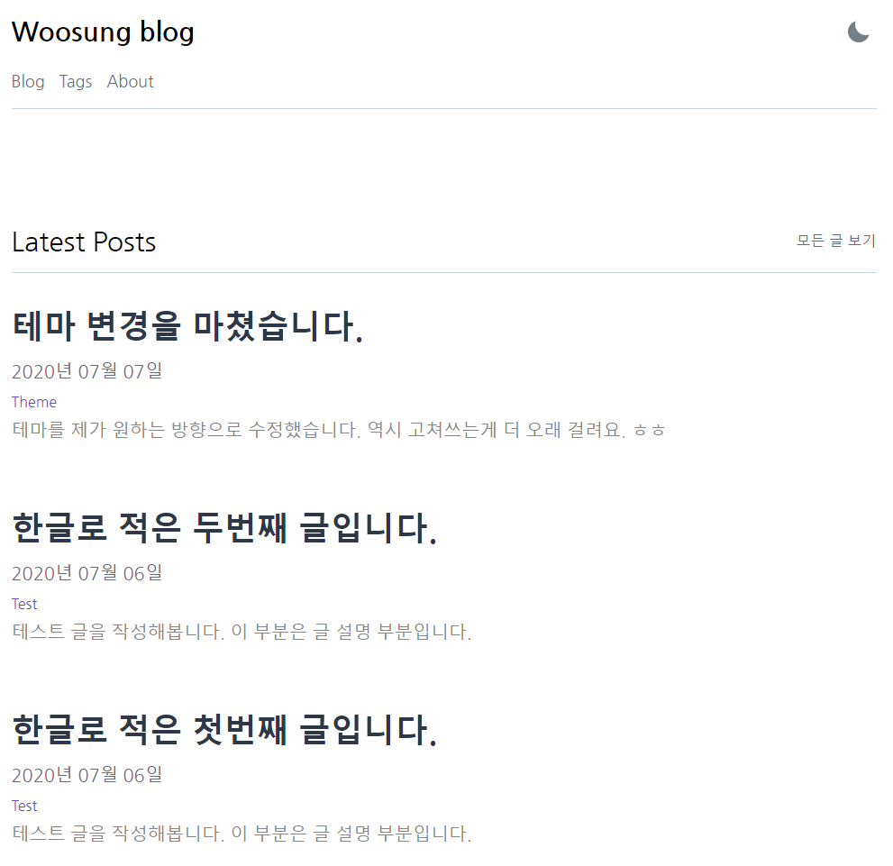
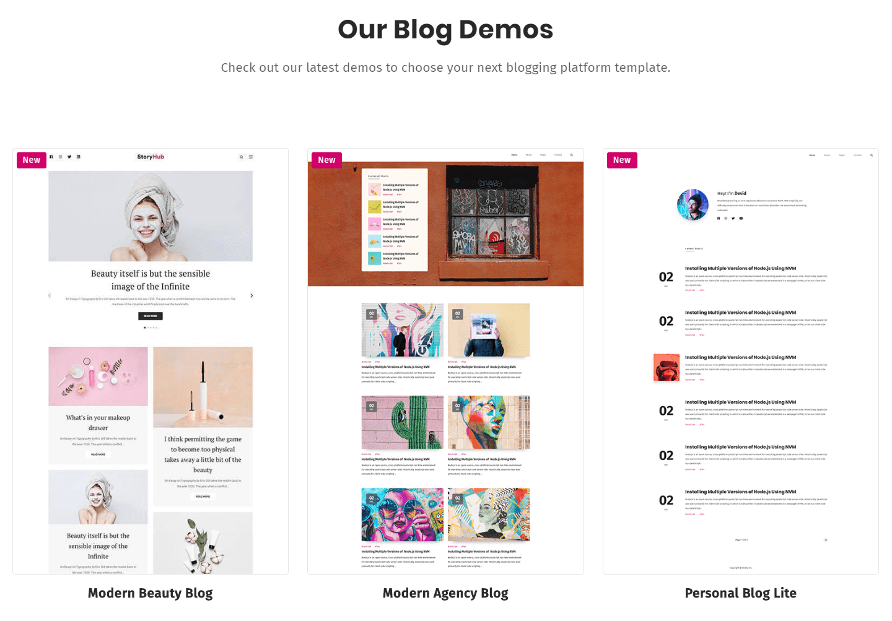

### 어느정도 원하는 방향으로 수정했습니다.

<a href="https://github.com/woosungchoi/gatsby-minimal" target="_blank" rel="noopener noreferrer">깃허브 링크</a>

위 깃허브에 수정한 모든 사항을 기록해두었습니다.

기록된 것 이외에도 여러시도를 해보았지만.. 실패의 쓴 맛을 보았습니다. ㅠㅠ

그래도 얻은 것이 더 많으니 실패라고 보지 않습니다.

블로그를 꾸미다보니 역시 Next js로 만든 것보다 퍼포먼스가 훨씬 좋네요.

플러그인도 정말 많고, 예제도 많으며, 사용자도 많기 때문입니다.

테마포레스트에 진짜 깔끔한 테마도 있던데 한번 시도해보고 싶습니다.

<a href="https://themeforest.net/item/storyhub-react-gatsby-blog-template/23897134" target="_blank" rel="noopener noreferrer">StoryHub Gatsby 블로그 템플릿</a>

위 블로그 템플릿이 예제도 많고, 정말 좋더라구요.

다크테마도 넣어달라고 댓글에 적었더니 추후에 반영한다고 합니다. ㅎㅎ