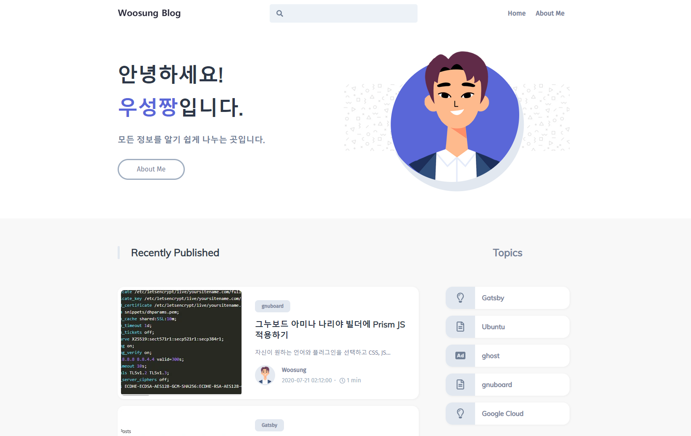
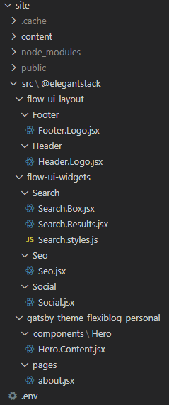

## FlexiBlog에 대한 관심

지난 달에 <a href="https://blog.wsgvet.com/gatsby-flexyblog/" target="_blank" rel="noopener noreferrer">FlexiBlog 괜찮은 것 같습니다.</a> 라는 글을 소개해드렸습니다.

테마포레스트에서 지속적으로 업데이트하는 모습에 감명을 받았습니다.

```
Release Log
2.3.0 (2020-08-06)
2.2.3 (2020-08-02)
2.2.2 (2020-08-02)
2.2.1 (2020-08-01)
2.2.0 (2020-07-28)
2.1.0 (2020-07-27)
2.0.0 (2020-07-26)
1.2.0 (2020-07-14)
1.1.0 (2020-07-06)
```

이미지 줌 기능, 다크 모드 기능을 요청했었는데요. 아시다시피 이런 프로젝트는 개발자가 생각하는 로드맵이 있습니다.

`To do list`에는 넣었다고 했지만 언제 될지는 모르는 상황이죠.

그래도 테마포레스트에서 가장 활발하게 개발하고, 디자인 및 기능이 매우 뛰어나기 때문에 매력적인 테마임이 분명했습니다.

특히 `Algolia` 검색 기능은 능력자의 경우 탑재하기가 쉽겠지만, 초보의 경우 정말 어렵습니다.

그 부분을 쉽게 적용가능하게 한 것이 가장 큰 장점이라고 생각합니다.

---

## Minimal-blog에 대한 소회

기존에 사용하던 `minimal-blog`도 매우 매력적이었습니다.

특히 블로그 내용에 충실할 수 있는 디자인, 글자 위주로 표시되는 정말 미니멀 그 자체였습니다.

그럼에도 불구하고, `SEO`를 위한 `Sitemap`, `RSS`가 기본적으로 탑재되어 있었구요. 

이미지 최적화도 당연히 있었습니다.

하지만 심심한 첫화면, 이미지가 없는 글목록에 아쉬운 점이 많았습니다.

기능적인 측면에서는 완성도가 높았지만, 디자인적인 측면에서는 아쉬운 점이 있었던 것이죠.

---

## FlexiBlog 특장점

위에도 적었지만 `Algolia` 검색 기능이 가장 매력적이라고 생각합니다. 블로그에서 검색하는 일이 드물지만, 기능이 있고 없고는 큰 차이가 있죠.

그리고 첫 화면 및 글목록에서 제공되는 썸네일이 좋았구요.

특히 `Category` 기능과 `Tag` 기능이 동시에 지원되는 것이 마음에 들었습니다.

서로 독립적으로 설정할 수 있기 때문에 관련 글 보기도 편하구요.

---

## FlexiBlog 아쉬운 점

이미지 줌 기능, 다크 모드 지원이 아직되지 않았습니다.

이 부분은 옵션이기 때문에 기능 및 디자인에서 필수는 아닙니다.

그래도 빨리 적용되면 좋을 것 같습니다.

테마를 변경하면서 가장 어려웠던 점은, 매뉴얼이 생각보다 부실하다는 것입니다.

테마를 구매하고 파일을 다운 받아야 매뉴얼이 있는 페이지에 갈 수 있는데요.

처음에는 상당히 자세하게 적혀있다고 생각했지만, 커스텀 작업을 하다보니 대충 적어둔 부분이 너무 많았습니다.

특히 첫화면 수정하는 방법은 다 알려줘야된다고 생각하는데요.

그 부분도 전부 사용자가 찾아야되는 점이 어려웠습니다.

저는 초보이기 때문에, 테마포레스트의 `Support` Mail을 정말 자주 이용했는데요.

3일 동안 거의 30통 넘게 보냈습니다.

그래도 개발자가 전부 잘 알려주더라구요. ㅎㅎ

---

## Component shadowing

`Gatsby`에서는 컴포넌트 쉐도잉을 지원합니다.

전통적인 테마 수정방법은 해당 파일을 직접 수정하는 것이죠.

하지만 컴포넌트 쉐도잉은 원본 파일은 그대로 두고, 수정하고 싶은 파일을 새로 만들어 자신의 폴더에 두는 개념입니다.

정적 사이트를 생성할 때 원본 파일을 읽지 않고, 쉐도잉한 파일을 읽는 것이죠.

원본 테마가 업데이트 되어도, 수정한 부분은 그대로 남기 때문에 유지관리하기 정말 편합니다.

하지만 해당 개념을 정확하게 이해하지 못하거나, 이해했더라도 어떤 파일을 어떤 위치에 쉐도잉해야 되는지 모를 경우 정말 힘듭니다.

그래서 개발자와 꾸준히 대화하여 원하는 부분은 모두 수정했습니다.



위와 같이 `site` 폴더 아래에 `src` 폴더를 생성하여 원하는 위치에 파일을 두면 됩니다.

각각에 대한 설명은 차근차근히 해드리도록 하겠습니다.

간단하게 알려드리면,

`Footer` : 홈페이지 하단 문구 수정
`Search` : `Algolia` 검색창 내부 글자 수정
`Seo` : 기본 언어 한국어로 수정
`Social` : Let's talk 부분 문구 수정
`Hero` : 첫 화면 소개 문구 수정
`pages` : about me 소개 수정

이렇게 되겠네요.

정말 어려웠지만 해냈습니다. ㅎㅎ

---

## 직접 추가한 기능

`PWA` 웹사이트로 만들고 싶어 `manifest` 및 `offline` 플러그인을 설치했습니다.

`RSS` 및 `Sitemap` 기능을 직접 추가했습니다. 플러그인을 설치하면 끝이지만, `RSS`의 경우 메타데이터를 뽑아서 정렬해줘야 되는 부분이 있었습니다.

그래서 `Graphql query`를 공부하고 이해하여 장착했습니다.

이외에 `Hero` 이미지 다운 받아서 펜툴로 직접 이미지 영역 잡아서 투명 배경 만들어 주기 등등 많은 것을 했네요.

상세 내용은 차근차근히 올려보도록 하겠습니다.

감사합니다.