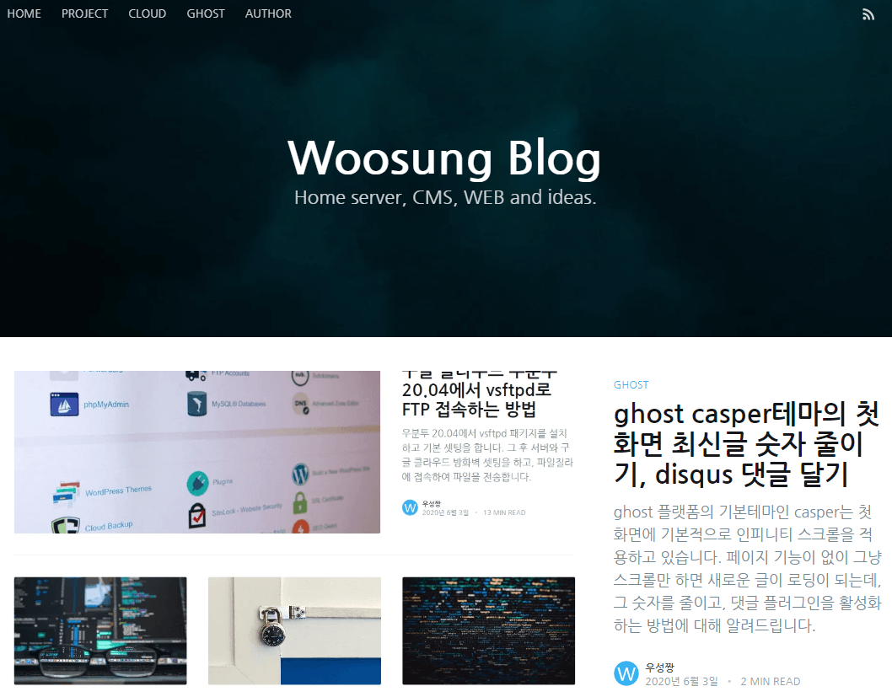
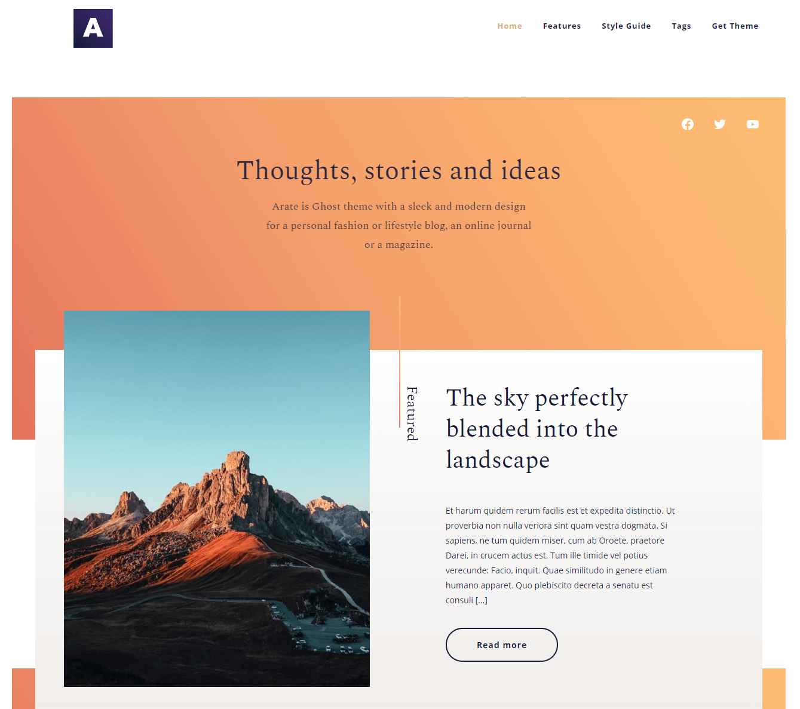
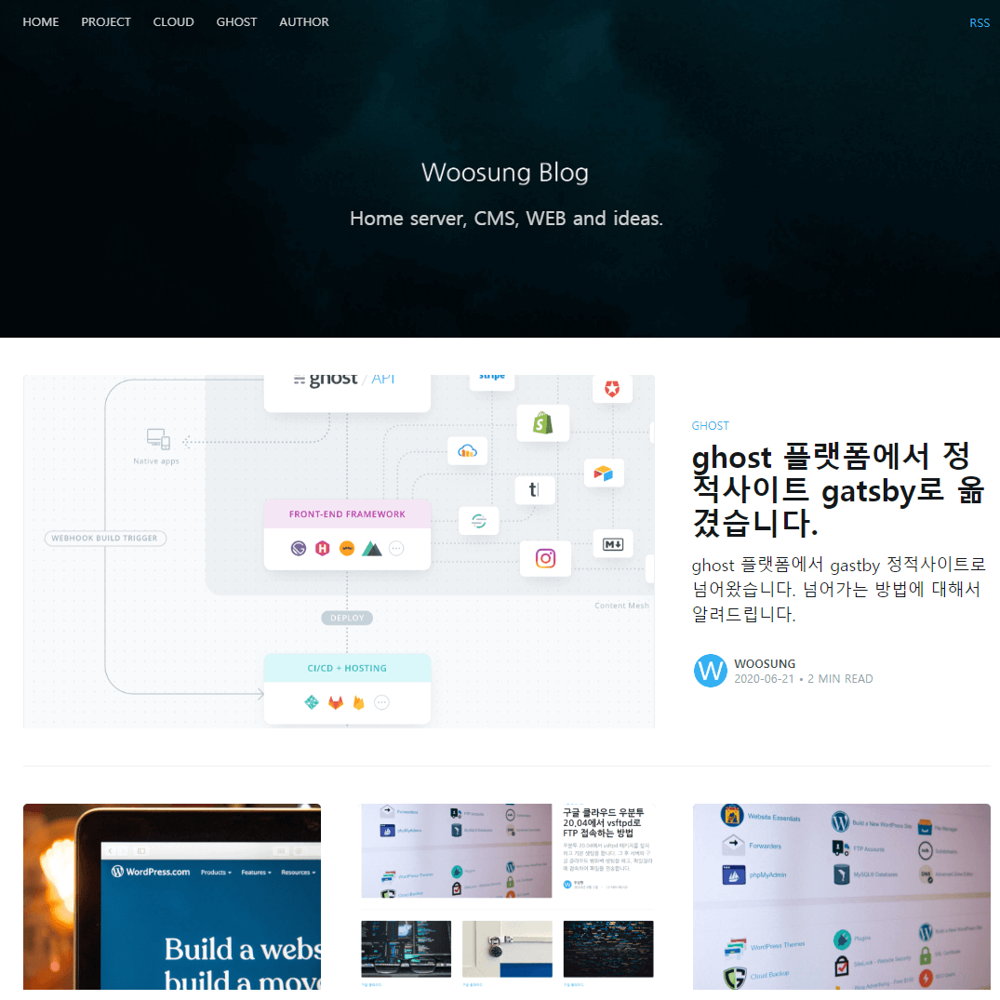
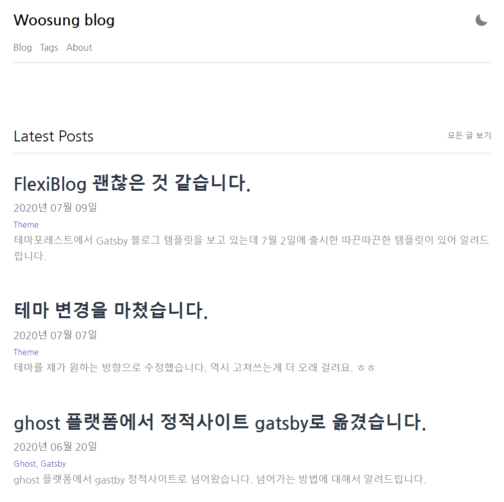

### Ghost 플랫폼의 Casper 기본 테마입니다.

<a href="https://demo.ghost.io/" target="_blank" rel="noopener noreferrer">https://demo.ghost.io/</a>

깔끔한 UI에 쓰기 편리한 CMS인 Ghost입니다.

처음에 접했을 때 `Node.js`로 돌아가는 홈페이지가 있다는 것을 알고 깜짝 놀랐었습니다.

`LAMP`, `LEMP`와 같은 전통적인 `DB`, `PHP`, `CMS`로 수동으로 구축했었는데, 완전히 새로운 방식으로 만들어졌기 때문입니다.

속도도 생각보다 엄청 빠르고, 그누보드 워드프레스에서 못보던 블로그에 특화된 테마도 많았구요.

---

<a href="https://arate.fueko.net/" target="_blank" rel="noopener noreferrer">https://arate.fueko.net/</a>

특히 위 블로그 테마를 보고 충격 받았었습니다.

혁신적인 블로그 UI가 바로 이런 것이구나... 라는 것을 느꼈었습니다.

그래서 홈서버에 `Node.js`를 깔고 직접 고스트 블로그를 운영하며 즐거웠는데요.

좀더 찾아보니 `Ghost` 플랫폼은 지는 해였습니다.

`Jamstack`이라는 정적사이트의 시대가 왔기 때문입니다.

---

### Gatsby와의 만남

정적사이트는 전통적인 서버조차도 필요없는 서버리스 기술로써, `Vercel`이나 `Netlify` 같은 대인배 회사에서 무료로 호스팅(배포)되었습니다.

게다가 DB가 필요없는 정적파일로만 구성되어 속도도 초광속이었습니다.

워드프레스 캐시를 최적화하여 빠른 속도를 만드려고 했던 저는, 그 속도에 반해서 넘어갈 수 밖에 없었습니다.

그리하여 `Ghost` 플랫폼을 버리고 `Gatsby`에서 `Casper`를 포팅한 테마로 옮깁니다.

---

<a href="https://casper.woosung.vercel.app/" target="_blank" rel="noopener noreferrer">https://casper.woosung.vercel.app/</a>

`Ghost`의 `Casper`와 95% 이상 동일한 UI를 가지고 있습니다.

세세한 기능까지 들어가면 차이가 있지만, 적어도 표현되는 방식은 큰 차이없이 운영할 수 있었습니다.

속도도 기존 플랫폼에서는 상상하지도 못하게 빨랐구요. 매우 만족했습니다.

---

### Gatsby Minimal과의 만남

하지만 `Gatsby Casper` 블로그의 경우 최근 업데이트가 없어서 보안 문제가 있었습니다.

사용하기에는 무리가 없지만, 빠르게 발전하는 기술에서 도태되는 느낌이 들어 `Minimal` 테마로 옮기기로 결정합니다.

<a href="https://github.com/LekoArts/gatsby-themes/tree/master/themes/gatsby-theme-minimal-blog" target="_blank" rel="noopener noreferrer">Github 바로가기</a>

현재 위와 같이 미니멀 블로그로 이전하였습니다.

`Minimal` 블로그는 특히 `Gatsby` 개발자가 개발, 유지, 보수하기 때문에 업데이트 걱정이 필요없었으며,

`RSS`, `Sitemap`, `SEO` 기능이 기본 탑재되어 초보도 쉽게 만들 수 있는 장점이 있었습니다.

속도도 빠르고, Code block 표현도 잘되며, `Utterances` 댓글로 쉽게 달 수 있습니다.

<a href="https://github.com/woosungchoi/gatsby-minimal/commit/e85fdb4ad650403c8542b08624cb53ef938521f1" target="_blank" rel="noopener noreferrer">Gatsby Casper에서 Minimal로 가는 힘겨운 여정</a>

위 커밋에서 힘겨운 이사 과정을 상세히 볼 수 있습니다.

현재로선 제 메인 홈페이지에 주력하고, 이 블로그는 최신 기술을 경험하는 차원에서 유지할 예정입니다.

또다른 여정이 다가올 수 있지만, 지금은 매우 만족하고 있습니다.

만약에 다른 테마로 넘어간다면 flexblog일 것입니다.