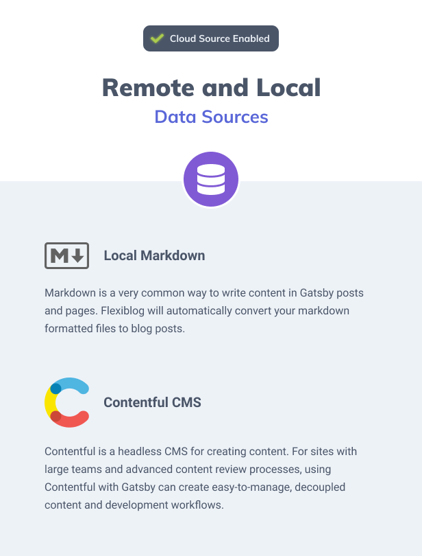
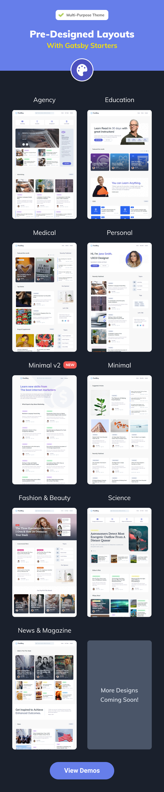
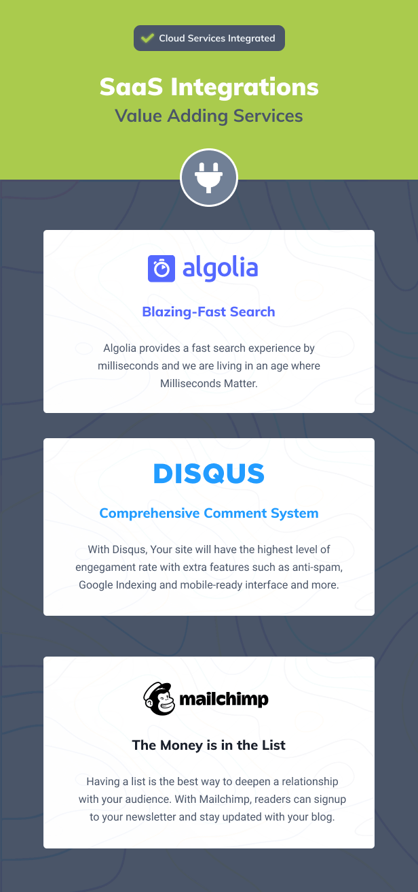

### 소스는 로컬과 Contentful CMS와 연결

위와 같이 원격, 로컬에서 마크다운 파일을 소스로 사용하여 표현할 수 있습니다.

현재는 로컬에서 만든 마크다운이나, Contentful CMS에서 만든 소스와 연결하여 표현할 수 있습니다.

### 미리 디자인 된 레이아웃

위와 같이 현재 9가지의 레이아웃이 제공되고 있습니다.

블로그, 뉴스, 매거진, 에이전시에서 충분히 실사용 가능한 퀄리티의 레이아웃입니다.

### 꼭 필요한 기능 추가

algolia 검색 기능, disqus 댓글 기능, mailchimp 구독 기능이 포함되어 있습니다.

디스커스는 탑재하기 쉽지만, 알고리아나 메일침프는 초보가 탑재하기 어려운 기능인데요.

유료 템플릿인만큼 탑재되어 있는 것이 좋습니다.

그외 블로그 리스트 디자인이 다양하고, 개발자 친화적인 커스터마이징 코드가 있구요.

404 페이지나, 태그 모음 페이지 등이 포함되어 있습니다.

Jamstack에 특화된 템플릿 만드는 업체라고하니 기대됩니다.

### 링크

<a href="https://themeforest.net/item/flexiblog-react-gatsby-blog-template/27538998" target="_blank" rel="noopener noreferrer">FlexiBlog - React Gatsby Multipurpose Blog Template</a>

