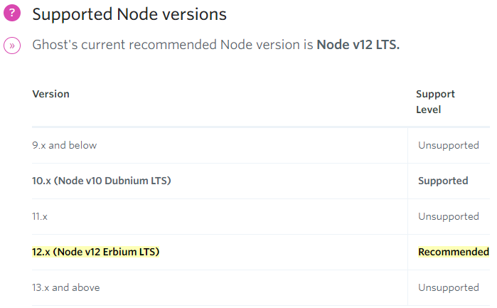
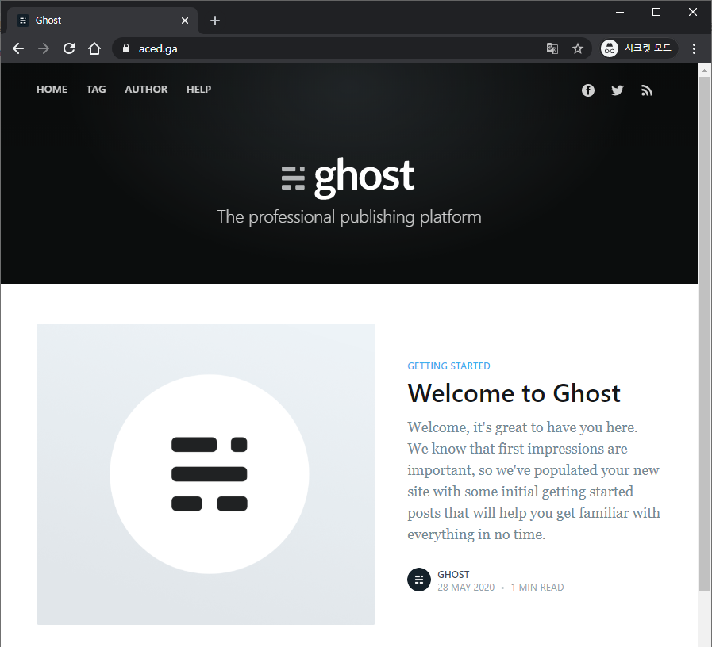
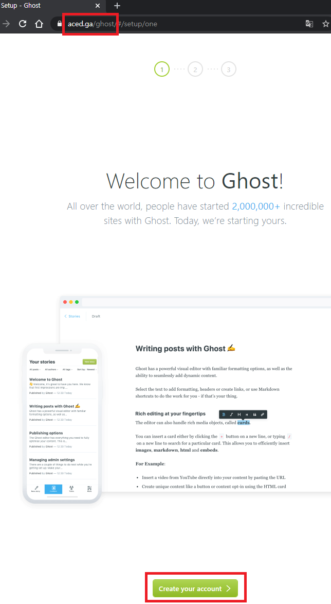
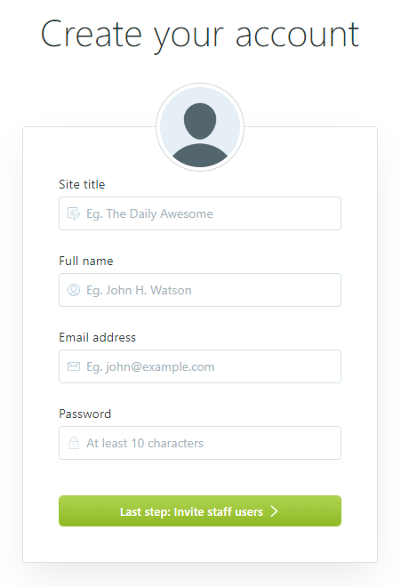
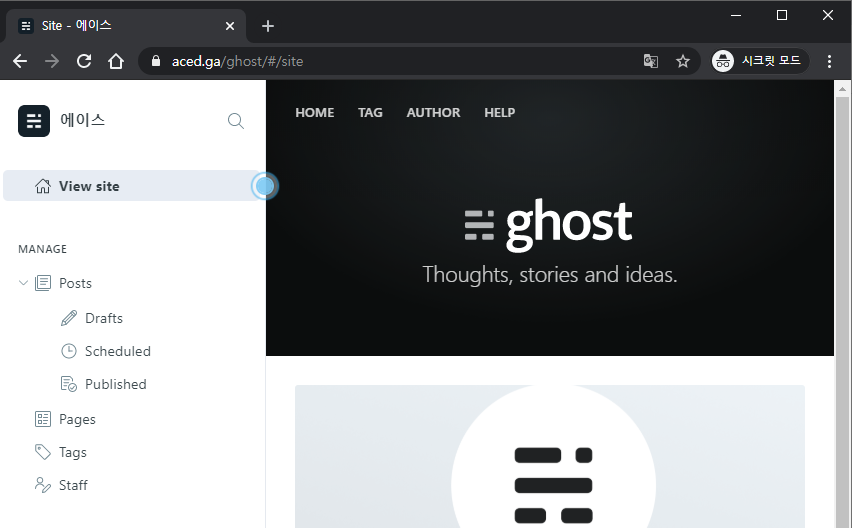

드디어 현재 이 홈페이지에서 사용하고 있는 ghost 플랫폼을 설치하기 위한 조건은 완성되었습니다.

## 1. ghost 전용 Database 생성하기

SSH 창을 열고

    sudo mysql -u root -p
    

위 명령어로 `MariaDB`로 접속합니다. `MariaDB`의 root 비번을 넣으면 접속이 됩니다.

    CREATE DATABASE ghost;
    

위 명령어로 `ghost` 라는 DB를 만듭니다.

    CREATE USER 'ghostuser'@'localhost' IDENTIFIED BY 'yourpassword';
    

`MariaDB` 전용인 `ghostuser` 라는 계정을 로컬호스트에 생성하고, `yourpassword`라는 비번을 부여해줍니다.

`yourpassword`는 자신이 원하는 비번을 변경하세요!

    GRANT ALL ON ghost.* TO 'ghostuser'@'localhost' IDENTIFIED BY 'yourpassword' WITH GRANT OPTION;
    

위 명령어로 `ghostuser`가 `ghost`라는 DB의 모든 권한을 얻습니다.

    FLUSH PRIVILEGES;
    EXIT;
    

위 두 명령어로 저장 후 나갑니다.

---

## 2. ghost 전용 계정 생성하기

    sudo adduser ghostuser
    

`ghostuser` 라는 계정을 만들 것입니다. 아까 `MariaDB`에서 만든 계정과 다른 존재입니다. 혹시나 다른 이름을 원하시면 바꾸셔도 됩니다. 

바꾼다면, 밑에 있는 모든 `ghostuser`를 바꾼 이름으로 넣으면 됩니다.

참고로 `ghost`라는 이름은 사용해선 안됩니다. 

`ghost` 플랫폼에서 사용할 이름이기 때문입니다.

비번을 두번 똑같이 넣으면 됩니다. 

참고로 여기서도 비번이 표시가 안됩니다. 당황하지 마세요 ㅎㅎ

```
$ sudo adduser ghostuser
 Adding user `ghostuser' ... Adding new group `ghostuser' (1003) ...
 Adding new user `ghostuser' (1002) with group `ghostuser' ...
 Creating home directory `/home/ghostuser' ... Copying files from `/etc/skel' ...
 New password:
 Retype new password:
 passwd: password updated successfully
 Changing the user information for ghostuser
 Enter the new value, or press ENTER for the default
 Full Name []:
 Room Number []:
 Work Phone []:
 Home Phone []:
 Other []:
 Is the information correct? [Y/n]
```

위와 같이 비번만 넣고 나머지는 그냥 엔터만 쳐도 넘어갑니다.

    sudo usermod -aG sudo ghostuser
    

위 명령어로 `ghostuser`가 슈퍼유저그룹에 속하게 됩니다.

    sudo su ghostuser
    

`ghostuser` 계정으로 전환합니다.

---

## 3. Node.js 패키지 설치하기

<a href="https://ghost.org/faq/node-versions" target="_blank" rel="noopener noreferrer">https://ghost.org/faq/node-versions</a>

위 링크는 현재 `ghost`에서 지원하는 노드 버전입니다.



2020년 5월 28일 현재 12.x (Node v12 Erbium LTS)를 권장합니다.

    curl -sL https://deb.nodesource.com/setup_12.x | sudo -E bash
    

비번을 넣으라고 나올 수 있는데, `ghostuser`의 비번을 넣어주면 됩니다.

위 명령어로 12.x 버전의 노드 저장소를 추가해줍니다. x에 숫자를 넣는게 아니라 그냥 x 그대로 놔두면 됩니다.

    sudo apt-get install -y nodejs
    

위 명령어로 `node.js`를 설치해줍니다.

    sudo npm install ghost-cli@latest -g
    

위 명령어로 `ghost-cli` 이라는 커맨드라인 툴을 설치합니다.

```
$ sudo npm install ghost-cli@latest -g
 /usr/bin/ghost -> /usr/lib/node_modules/ghost-cli/bin/ghost

 ghost-cli@1.14.0
 added 411 packages from 204 contributors in 23.215s
```

위와 같이 잘 설치되었습니다.

---

## 4. ghost 설치

    sudo mkdir -p /var/www/ghost
    

위 명령어로 `ghost`가 설치된 폴더를 생성합니다.

    sudo chown ghostuser:ghostuser /var/www/ghost
    

위 명령어로 해당 폴더의 소유권을 `ghostuser`에게 줍니다.

    sudo chmod 775 /var/www/ghost
    

위 명령어로 해당 폴더에 775 권한을 줍니다.

    cd /var/www/ghost
    

위 명령어로 이동합니다.

    ghost install
    

이제 제일 중요한 `ghost` 인스톨 시간입니다.

```
$ ghost install
 ✔ Checking system Node.js version
 ✔ Checking logged in user
 ✔ Checking current folder permissions
 System checks failed with message: 'Linux version is not Ubuntu 16 or 18'
 Some features of Ghost-CLI may not work without additional configuration.
 For local installs we recommend using `ghost install local` instead.
 ? Continue anyway? (y/N)
```

위와 같이 시스템 체크 실패가 나오는데요. 우분투 20.04 버전은 아직 공식적으로 지원하지 않기 때문입니다.
걱정없이 Y 엔터 누르면 됩니다.

```
 ? Continue anyway? Yes
 System stack check skipped
 ℹ Checking operating system compatibility [skipped]
 ✔ Checking for a MySQL installation
 ✔ Checking memory availability
 ✔ Checking for latest Ghost version
 ✔ Setting up install directory
 ✔ Downloading and installing Ghost v3.17.1
 ✔ Finishing install process
 ? Enter your blog URL: (http://localhost:2368)
```

이 부분이 `ghost` 블로그의 주소를 결정합니다. 저는 aced.ga 도메인을 가지고 있기 때문에 https://aced.ga 를 넣었습니다.

https는 꼭 넣어주세요. SSL 인증서 발급 후 적용 가능합니다.

그리고 요새는 www는 붙이지 않는 것이 대세더라구요. 

www.aced.ga 로 들어와도 aced.ga로 변환되게 설정할 것입니다.

```
 ? Enter your blog URL: https://aced.ga
 ? Enter your MySQL hostname: localhost
 ? Enter your MySQL username: ghostuser
 ? Enter your MySQL password: [hidden]
 ? Enter your Ghost database name: ghost
```

이제 위와 같이 `MySQL` 관련 질문을 하는데, 아까 `MariaDB`에서 생성했던 바로 그 부분입니다.

처음에는 `localhost`는 엔터만 치면 됩니다. `MariaDB`에서 생성했던 유저가 `ghostuser`였고, 비번도 그때 지정한 그 비번을 넣으면 됩니다. `database name`도 아까 `ghost`라고 지정해줬죠? ^^

```
 ✔ Configuring Ghost
 ✔ Setting up instance

 sudo useradd --system --user-group ghost

 sudo chown -R ghost:ghost /var/www/ghost/content
 ✔ Setting up "ghost" system user
 ℹ Setting up "ghost" mysql user [skipped]
```

이제 위와 같이 설치가 될겁니다.

```
? Do you wish to set up Nginx? (Y/n)
```

위와 같이 Nginx 설정을 할까? 물어보는데, Y 누르고 엔터를 누릅니다.

```
 ? Do you wish to set up Nginx? Yes
 ✔ Creating nginx config file at /var/www/ghost/system/files/aced.ga.conf

 sudo ln -sf /var/www/ghost/system/files/aced.ga.conf /etc/nginx/sites-available/aced.ga.conf

 sudo ln -sf /etc/nginx/sites-available/aced.ga.conf /etc/nginx/sites-enabled/aced.ga.conf

 sudo nginx -s reload

 ✔ Setting up Nginx
```

이렇게 설치가 됩니다. 

윗 부분에서 **/etc/nginx/sites-enabled/aced.ga.conf** 이 경로가 `Nginx`에서 매우 중요합니다.

SSL 수동 셋팅할때 이 경로의 파일을 수정할 것이기 때문에 체크해두세요!

```
 ? Do you wish to set up SSL? (Y/n)
```

위와 같이 설정이 되었고 SSL 설정을 원하냐고 물어봅니다.

Y 엔터를 누르면 자동으로 설정해줍니다.(강력 추천)

자동으로 편하게 쓰고 싶으시면 Y 엔터를 추천드립니다.

와일드카드 인증서 설정 및 자체 인증서로 설정하고 싶다면 N 엔터를 누릅니다.

SSL 상세 설정은 뒷 부분에서 설정할 것입니다.

```
 ? Do you wish to set up SSL? No
 ℹ Setting up SSL [skipped]
```

`Y` 엔터를 눌렀다면 자동으로 Letsencrypt로 발급 후 알아서 Nginx까지 설정해줍니다.

이메일 넣고 조금만 기다리면 알아서 `acme.sh`를 통해 webroot 방식으로 인증서를 발급해줍니다.

하지만 와일드카드 인증서 설정을 위해서 N 엔터를 눌렀다면 스킵이 될 것입니다.

```
 ? Do you wish to set up Systemd? Yes
```

Sysemd 설정을 원하냐고 물어보는데  y 엔터를 누릅니다.

```
 ✔ Creating systemd service file at /var/www/ghost/system/files/ghost_aced-ga.service

 sudo ln -sf /var/www/ghost/system/files/ghost_aced-ga.service /lib/systemd/system/ghost_aced-ga.service

 sudo systemctl daemon-reload
 ✔ Setting up Systemd

 sudo systemctl is-active ghost_aced-ga
 ? Do you want to start Ghost? Yes
```

이제 위와 같이 `Ghost`를 시작하겠냐고 물어보는데 y 엔터를 누릅니다.

```
 sudo systemctl start ghost_aced-ga

 sudo systemctl is-enabled ghost_aced-ga

 sudo systemctl enable ghost_aced-ga --quiet
 ✔ Starting Ghost

 Ghost uses direct mail by default. To set up an alternative email method read our docs at [https://ghost.org/docs/concepts/config/#mail](https://ghost.org/docs/concepts/config/#mail)
```

---

```
Ghost was installed successfully! To complete setup of your publication, visit:

https://aced.ga/ghost/
```

SSL 인증서를 자동으로 설정했다면 위 주소로 바로 `ghost` 환경설정에 들어갈 수 있습니다.

바로 `6. ghost 접속하기`로 건너뛰어 가면 됩니다!


SSL 인증서를 수동으로 설정한다고 선택했다면 할일이 더 남았습니다.

---

## 5. SSL 설정하기

SSL 인증서를 미리 만들었다면 그대로 진행하면 됩니다.

SSL 인증서가 없다면

1. .cf, .ga, .gq, .ml .tk 무료 도메인을 가지고 있는 경우 이 단계에서 인증서를 생성할 수 있습니다.

<a href="https://www.wsgvet.com/bbs/board.php?bo_table=home&wr_id=640" target="_blank" rel="noopener noreferrer">LuaDNS API를 이용한 무료도메인 와일드카드 SSL 인증서 발급 받기</a>

위 링크를 통해서 클라우드플레어가 아닌 LusDNS를 통해 무료도메인도 와일드카드 인증서를 발급받을 수 있습니다.

webroot 방식보다 DNS 방식으로 발급 받는 것이 훨씬 편하므로 강력 추천드립니다.

---

번거롭지만 webroot 형식으로 발급 받으려면 밑에 `5-1. SSL 설정하기(무료 도메인 전용)`을 참고하세요!

현재 `ghost`에서 webroot 형식으로 수동으로 받으려니 잘 안됩니다.

그냥 4. ghost 설치에서 자동으로 설정하는 것이 시간과 정신건강을 지키는 좋은 방법으로 보입니다.

---

2. .com, .net, .co.kr 등 유료 도메인을 가지고 있는 경우

<a href="https://www.wsgvet.com/bbs/board.php?bo_table=home&wr_id=639" target="_blank" rel="noopener noreferrer">DNS 인증을 통한 acme.sh Letsencrypt SSL 인증서 발급받기</a>

위 링크에서 클라우드플레어를 통하여 매우 쉽게 와일드카드 인증서 및 자동갱신을 설정할 수 있습니다.

---

이제 ghost 설치는 끝났지만 SSL 설정은 수동으로 좀더 해줘야 합니다.

    sudo openssl dhparam -out /etc/nginx/snippets/dhparams.pem 2048
    

위 명령어로 `dhparams.pem` 파일을 생성합니다.

대략 10~20초면 생성이 됩니다.

---

SSL 관련 설정파일을 미리 만들면 관리하기 편합니다.

    sudo nano /etc/nginx/snippets/ssl.conf
    

위 명령어로 설정파일 만들기에 들어갑니다.

    ssl_certificate /etc/nginx/ssl/fullchain.pem; # SSL 풀체인 인증서 경로. 자신의 환경에 맞게 바꾸세요.
    ssl_certificate_key /etc/nginx/ssl/privkey.pem; # SSL 프라이빗 키 경로. 자신의 환경에 맞게 바꾸세요.
    ssl_trusted_certificate /etc/nginx/ssl/chain.pem;  # SSL 인증서 경로. 자신의 환경에 맞게 바꾸세요.

    ssl_dhparam snippets/dhparams.pem;
    ssl_session_cache shared:SSL:10m;
    ssl_session_timeout 1d;
    ssl_session_tickets off;
    
    ssl_ecdh_curve X25519:sect571r1:secp521r1:secp384r1;
    ssl_stapling on;
    ssl_stapling_verify on;
    resolver 8.8.8.8 8.8.4.4 valid=300s;
    resolver_timeout 10s;
    
    ssl_protocols TLSv1.2 TLSv1.3;
    ssl_prefer_server_ciphers off;
    ssl_ciphers ECDHE-ECDSA-AES128-GCM-SHA256:ECDHE-RSA-AES128-GCM-SHA256:ECDHE-ECDSA-AES256-GCM-SHA384:ECDHE-RSA-AES256-GCM-SHA384:ECDHE-ECDSA-CHACHA20-POLY1305:ECDHE-RSA-CHACHA20-POLY1305:DHE-RSA-AES128-GCM-SHA256:DHE-RSA-AES256-GCM-SHA384;
    
    add_header X-Frame-Options SAMEORIGIN;
    add_header X-Content-Type-Options nosniff;
    add_header X-XSS-Protection "1; mode=block";     
    add_header Strict-Transport-Security "max-age=31536000; includeSubDomains; preload";
    

위 내용을 그대로 복사 후 붙여넣기 해줍니다.

제일 위에 인증서 경로를 꼭 수정해주세요!

컨트롤 + O, 엔터, 컨트롤 + X 엔터를 누르면 저장 후 빠져나옵니다.

---

아까 nginx 설정할 때 **/etc/nginx/sites-enabled/aced.ga.conf**  이 경로가 중요하다고 했죠?

이제 수정 할 것입니다.

    sudo nano /etc/nginx/sites-enabled/aced.ga.conf
    

위 명령어로 Nginx 설정을 할 것입니다.

SSH 창에 있는 모든 내용을 삭제합니다.

컨트롤+K를 누르면 한줄씩 삭제됩니다.

    server {
        listen 80;
        listen [::]:80;
        server_name www.aced.ga aced.ga; # aced.ga를 자신의 도메인으로 수정하세요.
        
        root /var/www/ghost/system/nginx-root; # Used for acme.sh SSL verification (https://acme.sh)

        location / {
            proxy_set_header X-Forwarded-For $proxy_add_x_forwarded_for;
            proxy_set_header X-Forwarded-Proto $scheme;
            proxy_set_header X-Real-IP $remote_addr;
            proxy_set_header Host $http_host;
            proxy_pass http://127.0.0.1:2368;
        }

        location ~ /.well-known {
            allow all;
        }

        client_max_body_size 50m;
    } 
    
    server {
    
    server_name aced.ga www.aced.ga; # aced.ga를 자신의 도메인으로 수정하세요.
    root /var/www/ghost/system/nginx-root;
    
    if ($host != 'aced.ga' ) {   # aced.ga를 자신의 도메인으로 수정하세요.
    rewrite ^/(.*)$  https://aced.ga/$1 permanent;    # aced.ga를 자신의 도메인으로 수정하세요.
    }
    
    location / {
        proxy_set_header X-Forwarded-For $proxy_add_x_forwarded_for;
        proxy_set_header X-Forwarded-Proto $scheme;
        proxy_set_header X-Real-IP $remote_addr;
        proxy_set_header Host $http_host;
        proxy_pass http://127.0.0.1:2368;
    }
    
    client_max_body_size 100m;
    server_tokens off;
    
    listen [::]:443 ssl http2 default_server ipv6only=on;
    listen 443 ssl http2 default_server;

    location ~ /.well-known {
        allow all;
    }
    
    include snippets/ssl.conf;
    }
    

위 내용을 전부 마우스로 긁어서 복사해서 붙여넣기 합니다.

`aced.ga` 대신에 자신의 도메인을 넣으세요!

컨트롤 + O, 엔터, 컨트롤 + X 엔터를 누르면 저장 후 빠져나옵니다.

    sudo nginx -t
    

위 명령어로 설정이 잘 되었는지 확인할 수 있습니다.

```
 $ sudo nginx -t
 nginx: the configuration file /etc/nginx/nginx.conf syntax is ok
 nginx: configuration file /etc/nginx/nginx.conf test is successful
```

위와 같이 `ok`와 `successful`이 나오면 성공입니다.

    sudo service nginx restart
    

위 명령어로 nginx를 재시작 해줍니다.

바로 `6. ghost 접속하기`로 건너 뛰세요!

---

## 5-1. SSL 설정하기(무료 도메인 전용)

.cf, .ga, .gq, .ml .tk와 같은 `Freenom`의 무료 도메인의 경우 DNS API 인증을 통한 인증서 발급이 어렵기 때문에 이 단계에서 작업해주면 됩니다.

이제 `ghost` 설치는 끝났지만 SSL 설정은 수동으로 좀더 해줘야 합니다.

    sudo openssl dhparam -out /etc/nginx/snippets/dhparams.pem 2048
    
위 명령어로 dhparams.pem 파일을 생성합니다.

대략 10~20초면 생성이 됩니다.

---

SSL 관련 설정파일을 미리 만들면 관리하기 편합니다.

    sudo nano /etc/nginx/snippets/ssl.conf
    

위 명령어로 설정파일 만들기에 들어갑니다.

    ssl_certificate /etc/nginx/ssl/fullchain.pem; # SSL 풀체인 인증서 경로. 자신의 환경에 맞게 바꾸세요.
    ssl_certificate_key /etc/nginx/ssl/privkey.pem; # SSL 프라이빗 키 경로. 자신의 환경에 맞게 바꾸세요.
    ssl_trusted_certificate /etc/nginx/ssl/chain.pem;  # SSL 인증서 경로. 자신의 환경에 맞게 바꾸세요.

    ssl_dhparam snippets/dhparams.pem;
    ssl_session_cache shared:SSL:10m;
    ssl_session_timeout 1d;
    ssl_session_tickets off;
    
    ssl_ecdh_curve X25519:sect571r1:secp521r1:secp384r1;
    ssl_stapling on;
    ssl_stapling_verify on;
    resolver 8.8.8.8 8.8.4.4 valid=300s;
    resolver_timeout 10s;
    
    ssl_protocols TLSv1.2 TLSv1.3;
    ssl_prefer_server_ciphers off;
    ssl_ciphers ECDHE-ECDSA-AES128-GCM-SHA256:ECDHE-RSA-AES128-GCM-SHA256:ECDHE-ECDSA-AES256-GCM-SHA384:ECDHE-RSA-AES256-GCM-SHA384:ECDHE-ECDSA-CHACHA20-POLY1305:ECDHE-RSA-CHACHA20-POLY1305:DHE-RSA-AES128-GCM-SHA256:DHE-RSA-AES256-GCM-SHA384;
    
    add_header X-Frame-Options SAMEORIGIN;
    add_header X-Content-Type-Options nosniff;
    add_header X-XSS-Protection "1; mode=block";     
    add_header Strict-Transport-Security "max-age=31536000; includeSubDomains; preload";
    

위 내용을 그대로 복사 후 붙여넣기 해줍니다.

제일 위에 인증서 경로는 제가 알려드릴 방법으로 하신다면 바꿀 필요없습니다.

컨트롤 + O, 엔터, 컨트롤 + X 엔터를 누르면 저장 후 빠져나옵니다.

---

이제 acme.sh를 통한 webroot 인증서 발급을 위한 준비는 끝났습니다.

### acme.sh 설치하기

```
sudo su
```

위 명령어로 root 계정으로 들어갑니다.

root 계정이 아니면 권한 문제가 생길 수 있습니다. 공식 매뉴얼에는 sudo 명령어를 추천하지 않습니다.

```
curl https://get.acme.sh | sh
```

위 명령어로 설치할 수 있습니다. 만약에 안된다면

```
wget -O - https://get.acme.sh | sh
```

위 명령어로도 설치할 수 있습니다.

설치할 때 빨간색 글자가 나올 수도 있는데, 무시해도 됩니다.

SSH 터미널(Putty 등)을 끄고, 다시 접속합니다.

SSH에 다시 접속하면 별다른 작업을 하지 않아도 root 계정으로 acme.sh 명령어를 바로 쓸 수 있습니다.

---

### 인증서 발급 받기

```
sudo su
mkdir /etc/nginx/ssl
```

우선 위와 같이 root로 로그인 후 SSL 인증서가 저장될 폴더를 생성합니다.

```
acme.sh --issue -w /var/www/ghost/system/nginx-root -d aced.ga -d www.aced.ga -d blog.aced.ga -d home.aced.ga -d nas.aced.ga --key-file /etc/nginx/ssl/privkey.pem --fullchain-file /etc/nginx/ssl/fullchain.pem --cert-file /etc/nginx/ssl/chain.pem --reloadcmd "systemctl reload nginx.service"

```
위와 같이 webroot 방식으로 발급받으면 멀티도메인 거의 무제한(100개까지)으로 발급 받을 수 있습니다.

발급 받고 싶은 도메인 주소도 -d example.com 형식으로 추가해주면 됩니다.

aced.ga만 자신의 도메인으로 수정해주세요!

```
[Tue 02 Jun 2020 10:35:49 PM KST] Your cert is in  /root/.acme.sh/aced.ga/aced.ga.cer
[Tue 02 Jun 2020 10:35:49 PM KST] Your cert key is in  /root/.acme.sh/aced.ga/aced.ga.key
[Tue 02 Jun 2020 10:35:49 PM KST] The intermediate CA cert is in  /root/.acme.sh/aced.ga/ca.cer
[Tue 02 Jun 2020 10:35:49 PM KST] And the full chain certs is there:  /root/.acme.sh/aced.ga/fullchain.cer
[Tue 02 Jun 2020 10:35:49 PM KST] Installing cert to:/etc/nginx/ssl/chain.pem
[Tue 02 Jun 2020 10:35:49 PM KST] Installing key to:/etc/nginx/ssl/privkey.pem
[Tue 02 Jun 2020 10:35:49 PM KST] Installing full chain to:/etc/nginx/ssl/fullchain.pem
[Tue 02 Jun 2020 10:35:49 PM KST] Run reload cmd: systemctl reload nginx.service
[Tue 02 Jun 2020 10:35:49 PM KST] Reload success
```

위와 같이 잘 발급되고, 원하는 위치에 인증서가 이동된 것을 확인할 수 있습니다.

참고로 `ECDSA` 인증서를 발급 받고 싶으시면

위 명령어에서 `--keylength ec-256` (prime256v1, ECDSA P-256) 또는 `--keylength ec-384` (secp384r1, ECDSA P-384)를 넣어주면 됩니다.

```
acme.sh --issue --keylength ec-256 -w /var/www/wordpress -d aced.ga -d www.aced.ga -d blog.aced.ga -d home.aced.ga -d nas.aced.ga --key-file /etc/nginx/ssl/privkey.pem --fullchain-file /etc/nginx/ssl/fullchain.pem --cert-file /etc/nginx/ssl/chain.pem --reloadcmd "systemctl reload nginx.service"
```

위와 같이 실행하면 ECDSA P-256 인증서가 생성됩니다.

다른 상세한 사항은 <a href="https://www.wsgvet.com/bbs/board.php?bo_table=home&wr_id=639" target="_blank" rel="noopener noreferrer">DNS 인증을 통한 acme.sh Letsencrypt SSL 인증서 발급받기</a>를 참조하세요!

acme.sh를 통해서 인증서를 생성하면 60일 뒤에 자동으로 갱신해줍니다. 그러니 자동갱신에 대한 걱정은 안하셔도 됩니다 ^^

---

### Nginx 설정하기

이제 SSL 인증서를 받았으니 웹서버단에서 수정해줘야 합니다.

아까 nginx 설정할 때 **/etc/nginx/sites-enabled/aced.ga.conf**  이 경로가 중요하다고 했죠?

이제 또 수정 할 것입니다.

    sudo nano /etc/nginx/sites-enabled/aced.ga.conf
    
위 명령어로 Nginx 설정을 할 것입니다.

위 내용에서 `aced.ga`를 자신의 도메인으로 바꾸세요!

SSH 창에 있는 모든 내용을 삭제합니다.

컨트롤+K를 누르면 한줄씩 삭제됩니다.

    server {
        
        listen 80;
        listen [::]:80;
        
        server_name www.aced.ga aced.ga; # aced.ga를 자신의 도메인으로 수정하세요.
        
        root /var/www/ghost/system/nginx-root; # Used for acme.sh SSL verification (https://acme.sh)

        location / {
            proxy_set_header X-Forwarded-For $proxy_add_x_forwarded_for;
            proxy_set_header X-Forwarded-Proto $scheme;
            proxy_set_header X-Real-IP $remote_addr;
            proxy_set_header Host $http_host;
            proxy_pass http://127.0.0.1:2368;
        }

        location ~ /.well-known {
            allow all;
        }

        client_max_body_size 50m;
    } 
    
    server {

    listen [::]:443 ssl http2 ipv6only=on;
    listen 443 ssl http2;

    server_name aced.ga www.aced.ga; # aced.ga를 자신의 도메인으로 수정하세요.

    root /var/www/ghost/system/nginx-root;
    
    if ($host != 'aced.ga' ) {   # aced.ga를 자신의 도메인으로 수정하세요.
    rewrite ^/(.*)$  https://aced.ga/$1 permanent;    # aced.ga를 자신의 도메인으로 수정하세요.
    }
    
    location / {
        proxy_set_header X-Forwarded-For $proxy_add_x_forwarded_for;
        proxy_set_header X-Forwarded-Proto $scheme;
        proxy_set_header X-Real-IP $remote_addr;
        proxy_set_header Host $http_host;
        proxy_pass http://127.0.0.1:2368;
    }
    
    location ~ /.well-known {
        allow all;
    }

    client_max_body_size 100m;
    server_tokens off;
    
    include snippets/ssl.conf;
    }

위 내용에서 `aced.ga`를 자신의 도메인으로 바꾸세요.

컨트롤 + O, 엔터, 컨트롤 + X 엔터를 누르면 저장 후 빠져나옵니다.

    sudo nginx -t
    

위 명령어로 설정이 잘 되었는지 확인할 수 있습니다.

```
 $ sudo nginx -t
 nginx: the configuration file /etc/nginx/nginx.conf syntax is ok
 nginx: configuration file /etc/nginx/nginx.conf test is successful
```

위와 같이 ok와 successful이 나오면 성공입니다.

    sudo service nginx restart
    

위 명령어로 nginx를 재시작 해줍니다.

---

## 6. ghost 접속하기

이제 드디어 인터넷 주소창에 자신의 도메인을 넣어봅니다.



위와 같이 나오면 성공입니다!

관리자 설정이 필요합니다.

주소창에

자신의도메인/ghost 로 들어갑니다.

저의 경우 [https://aced.ga/ghost](https://aced.ga/ghost) 입니다.




위와 같이 Create your account를 누릅니다.



홈페이지의 제목, 사용자이름, 이메일 주소, 비번을 넣고 Last step을 누릅니다.


스탭을 초대하라고 하지만 그냥 my site로 이동을 누릅니다.



이제 관리자 화면까지 왔습니다. 기존에 있던 글을 지우려면 Published에 들어가서 다 지울 수 있습니다.

감사합니다!

---

참조 사이트

<a href="https://ghost.org/docs/install/ubuntu" target="_blank" rel="noopener noreferrer">https://ghost.org/docs/install/ubuntu</a>

---

<a href="https://websiteforstudents.com/install-ghost-2-0-on-ubuntu-16-04-18-04-18-10-with-mariadb" target="_blank" rel="noopener noreferrer">https://websiteforstudents.com/install-ghost-2-0-on-ubuntu-16-04-18-04-18-10-with-mariadb</a>

