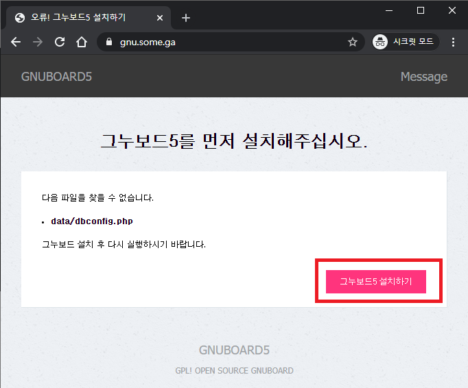
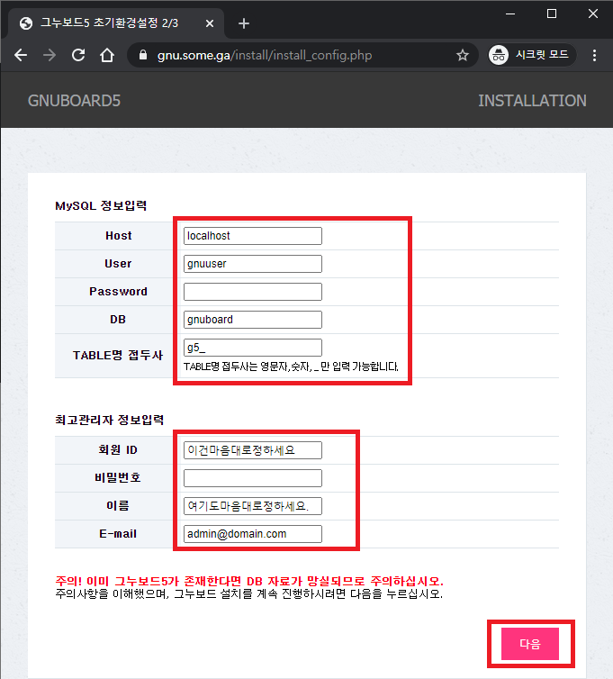
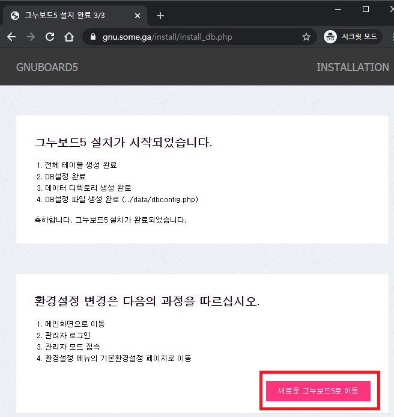
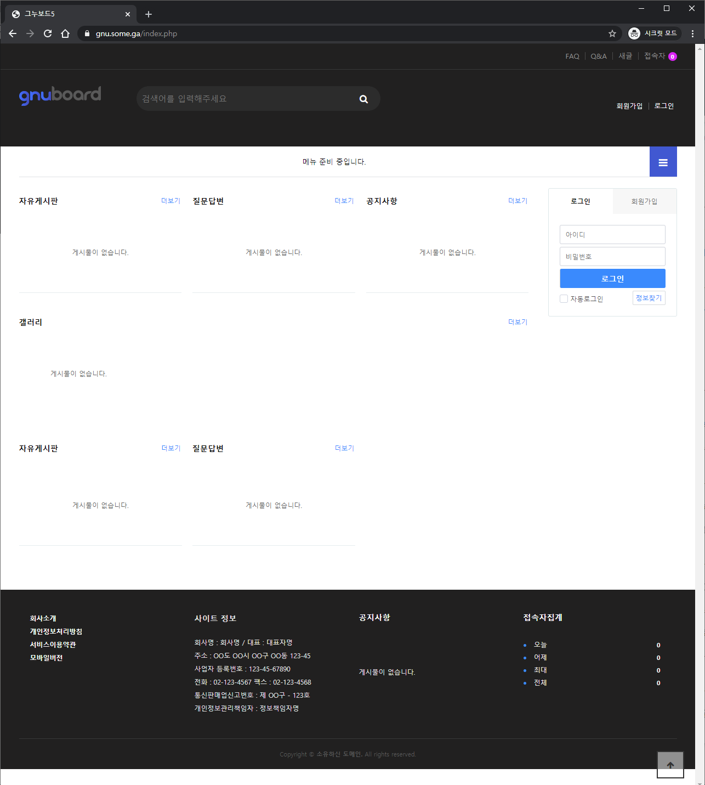

그누보드는 국산 설치형 무료 게시판입니다.

<a href="https://www.wsgvet.com" target="_blank" rel="noopener noreferrer">https://www.wsgvet.com</a>

현재 제가 메인 홈페이지로 쓰고 있는 중이기도 합니다.

제 홈페이지는 현재 그누보드 5.3이지만 테마만 괜찮은게 나오면 5.4로 넘어갈 예정입니다.

구글 클라우드 플랫폼의 무료 서버 성능에서는 ghost 플랫폼이나 그누보드를 동시에 운용하기에는 조금 벅찰 수 있습니다.

그래서 ghost를 설치할땐 node.js 설치만 했습니다.

다만 그누보드나 워드프레스 같은 경우 php로 구동되기 때문에 php를 따로 설치해야 합니다.

그래서 node.js와 완전히 독립적으로 이 설치기를 작성합니다.

---

## 1. php7.4 설치

    sudo apt install php7.4 php7.4-fpm php7.4-mysql php-common php7.4-cli php7.4-common php7.4-json php7.4-opcache php7.4-readline php7.4-mbstring php7.4-xml php7.4-gd php7.4-curl
    

위 명령어로 패키지를 설치합니다.

조금만 기다리면 설치가 완료됩니다.

    sudo systemctl enable php7.4-fpm
    

위 명령어로 재부팅시에 자동 시작되게 합니다.

    sudo systemctl start php7.4-fpm
    

위 명령어로 실행합니다.

---

## 2. MariaDB에 그누보드 전용 DB 및 유저 생성하기

    sudo mysql -u root -p
    

위 명령어로 DB에 접속합니다.

    CREATE DATABASE gnuboard;
    

위 명령어로 gnuboard라는 DB를 만듭니다.

    CREATE USER 'gnuuser'@'localhost' IDENTIFIED BY 'yourpassword';
    

위 명령어로 gnuuser라는 DB사용자를 만듭니다.

yourpassword 부분은 원하는 비번으로 **꼭** 수정하세요!

    GRANT ALL ON gnuboard.* TO 'gnuuser'@'localhost' IDENTIFIED BY 'yourpassword' WITH GRANT OPTION;
    

위 명령어로 gnuuser가 gnuboard라는 DB의 모든 권한을 얻습니다.

yourpassword 꼭 수정하세요!

    FLUSH PRIVILEGES;
    EXIT;
    

위 두 명령어로 저장 후 나갑니다.

## 3. 그누보드 설치파일 다운받기

    cd /var/www
    

위 명령어로 www 디렉토리로 이동합니다.

    sudo wget https://github.com/gnuboard/gnuboard5/tarball/master
    

위 명령어로 그누보드 최신버전을 다운 받습니다.

    sudo tar -xvf master
    

압축을 해제합니다.

```
 .
 .
 .
 gnuboard-gnuboard5-c875121/theme/basic/tail.php
 gnuboard-gnuboard5-c875121/theme/basic/tail.sub.php
 gnuboard-gnuboard5-c875121/theme/basic/theme.config.php
```

위와 같은 형식으로 압축이 해제됩니다.

폴더명을 바꿔줘야 합니다.

`gnuboard-gnuboard5-c875121` 이 부분을 gnuboard로 바꿀 것입니다.

이 부분은 버전이 업그레이드 되면서 항상 바뀌므로 **수정** 후 명령어를 입력해주세요.

    sudo mv gnuboard-gnuboard5-c875121 gnuboard
    

위 명령어로 폴더이름이 바뀌었습니다.

    sudo rm master
    

위 명령어로 압축파일을 삭제합니다.

---

이제 권한을 수정해야 합니다.

    sudo chmod -R 755 gnuboard
    

그누보드의 폴더 포함 모든 파일 및 폴더의 권한을 755로 줍니다.

    sudo mkdir /var/www/gnuboard/data
    

data 폴더를 생성합니다.

    sudo chmod 707 /var/www/gnuboard/data
    

data 폴더의 권한을 707로 줍니다.

    sudo chown -R www-data:www-data gnuboard
    

그누보드 폴더 이하의 모든 파일과 폴더의 소유권을 www-data에게 줍니다.

---

    sudo nano /var/www/gnuboard/config.php
    

위 명령어로 설정파일로 들어갑니다.

29번째줄에 보면

    define('G5_DOMAIN', '');
    define('G5_HTTPS_DOMAIN', '');
    

위 내용이 있습니다. 접속할 주소를 설정하는 곳입니다.

우리는 이미 SSL 인증서를 가지고 있기 때문에 둘다 같은 https 주소를 넣습니다.

저는 gnu.some.ga를 넣겠습니다.

aced.ga와 같이 서브도메인이 없이 넣어 됩니다. 이는 원하는대로 설정하시면 됩니다.

    define('G5_DOMAIN', 'https://gnu.some.ga');
    define('G5_HTTPS_DOMAIN', 'https://gnu.some.ga');
    

위와 같은 형식으로 넣고 저장하면 됩니다.

---

40번째 줄에

```
// Set Databse table default Charset
// utf8, utf8mb4 등 지정 가능 기본값은 utf8, 설치전에 utf8mb4 으로 수정시 모든 테이블에 이모지 입력이 가능합니다. utf8mb4 는 mysql 또는 mariadb 5.5 버전 이상을 요구합니다.
define('G5_DB_CHARSET', 'utf8mb4');
```

위와 같이 `utf8`을 `utf8mb4`로 바꿔줍니다. 이모지를 제목과 본문, 댓글에 표시할 수 있습니다.

---

그누보드 파일 설정은 이제 끝입니다.

---

## 4. Nginx 설정파일 만들기

(1) 그누보드 5.4 주소 rewirte 설정파일 만들어주기

    sudo nano /etc/nginx/snippets/gnuboard-rewirte.conf
    

위 명령어로 설정파일 만들기에 들어갑니다.

    #### 그누보드5 nginx rules BEGIN #####
    if (!-e $request_filename){
    rewrite ^/content/([0-9a-zA-Z_]+)$ /bbs/content.php?co_id=$1&rewrite=1 break;
    rewrite ^/content/([^/]+)/$ /bbs/content.php?co_seo_title=$1&rewrite=1 break;
    rewrite ^/rss/([0-9a-zA-Z_]+)$ /bbs/rss.php?bo_table=$1 break;
    rewrite ^/([0-9a-zA-Z_]+)$ /bbs/board.php?bo_table=$1&rewrite=1 break;
    rewrite ^/([0-9a-zA-Z_]+)/write$ /bbs/write.php?bo_table=$1&rewrite=1 break;
    rewrite ^/([0-9a-zA-Z_]+)/([^/]+)/$ /bbs/board.php?bo_table=$1&wr_seo_title=$2&rewrite=1 break;
    rewrite ^/([0-9a-zA-Z_]+)/([0-9]+)$ /bbs/board.php?bo_table=$1&wr_id=$2&rewrite=1 break;
    }
    #### 그누보드5 nginx rules END #####
    

위 내용을 그대로 복사 후 붙여넣기 해줍니다.

컨트롤 + O, 엔터, 컨트롤 + X 엔터를 누르면 저장 후 빠져나옵니다.

---

(2) SSL 관련 설정파일 만들기

    sudo nano /etc/nginx/snippets/ssl.conf
    

위 명령어로 설정파일 만들기에 들어갑니다.

    ssl_certificate /etc/nginx/ssl/fullchain.pem; # SSL 풀체인 인증서 경로. 자신의 환경에 맞게 바꾸세요.
    ssl_certificate_key /etc/nginx/ssl/privkey.pem; # SSL 프라이빗 키 경로. 자신의 환경에 맞게 바꾸세요.
    ssl_trusted_certificate /etc/nginx/ssl/chain.pem;  # SSL 인증서 경로. 자신의 환경에 맞게 바꾸세요.
    
    ssl_dhparam snippets/dhparams.pem;
    ssl_session_cache shared:SSL:10m;
    ssl_session_timeout 1d;
    ssl_session_tickets off;
    
    ssl_ecdh_curve X25519:sect571r1:secp521r1:secp384r1;
    ssl_stapling on;
    ssl_stapling_verify on;
    resolver 8.8.8.8 8.8.4.4 valid=300s;
    resolver_timeout 10s;
    
    ssl_protocols TLSv1.2 TLSv1.3;
    ssl_prefer_server_ciphers off;
    ssl_ciphers ECDHE-ECDSA-AES128-GCM-SHA256:ECDHE-RSA-AES128-GCM-SHA256:ECDHE-ECDSA-AES256-GCM-SHA384:ECDHE-RSA-AES256-GCM-SHA384:ECDHE-ECDSA-CHACHA20-POLY1305:ECDHE-RSA-CHACHA20-POLY1305:DHE-RSA-AES128-GCM-SHA256:DHE-RSA-AES256-GCM-SHA384;
    
    add_header X-Frame-Options SAMEORIGIN;
    add_header X-Content-Type-Options nosniff;
    add_header X-XSS-Protection "1; mode=block";     
    add_header Strict-Transport-Security "max-age=31536000; includeSubDomains; preload";
    

위 내용을 그대로 복사 후 붙여넣기 해줍니다.

제일 위에 인증서 경로를 자신의 환경에 맞게 수정해주세요!

제가 알려드린 `acme.sh`로 인증서를 생성했다면 수정하지 않아도 됩니다.

컨트롤 + O, 엔터, 컨트롤 + X 엔터를 누르면 저장 후 빠져나옵니다.

---

(3) dhparams.pem 생성하기

    sudo openssl dhparam -out /etc/nginx/snippets/dhparams.pem 2048
    

위 명령어로 dhparams.pem 파일을 생성합니다.

대략 10~20초면 생성이 됩니다.

---

SSL 인증서를 미리 만들었다면 그대로 진행하면 됩니다.

SSL 인증서가 없다면

1. .cf, .ga, .gq, .ml .tk 무료 도메인을 가지고 있는 경우 이 단계에서 인증서를 생성할 수 있습니다.

<a href="https://www.wsgvet.com/bbs/board.php?bo_table=home&wr_id=640" target="_blank" rel="noopener noreferrer">LuaDNS API를 이용한 무료도메인 와일드카드 SSL 인증서 발급 받기</a>

위 링크를 통해서 클라우드플레어가 아닌 `LuaDNS`를 통해 무료도메인도 와일드카드 인증서를 발급받을 수 있습니다.

webroot 방식보다 DNS 방식으로 발급 받는 것이 훨씬 편하므로 강력 추천드립니다.

---

webroot 방식으로 설치하려면 바로 밑에 `무료 도메인 전용 인증서 생성하기`를 참고하세요!

2. .com, .net, .co.kr 등 유료 도메인을 가지고 있는 경우

<a href="https://www.wsgvet.com/bbs/board.php?bo_table=home&wr_id=639" target="_blank" rel="noopener noreferrer">DNS 인증을 통한 acme.sh Letsencrypt SSL 인증서 발급받기</a>

위 링크에서 클라우드플레어를 통하여 매우 쉽게 와일드카드 인증서 및 자동갱신을 설정할 수 있습니다.

인증서를 생성했다면 밑의 `무료 도메인 전용 인증서 생성하기`는 건너뛰고 `(4) 서버 설정파일 만들기`로 넘어가면 됩니다!

---

### 무료 도메인 전용 인증서 생성하기

이제 Letsencrypt의 webroot 방식으로 인증서를 생성할 수 있습니다.

```
sudo nano /etc/nginx/sites-available/gnuboard
```

위 명령어로 `Nginx`설정파일을 만들고 들어갑니다.

```
server {
    listen 80;
    listen [::]:80;
    server_name www.some.ga some.ga;  #some.ga를 자신이 원하는 도메인으로 수정하세요.

    root /var/www/gnuboard;

    index index.php ;
    include snippets/gnuboard-rewirte.conf;

    location ~ \.(gif|jpg|png)$ {
        add_header Vary "Accept-Encoding";
        add_header Cache-Control "public, no-transform, max-age=31536000";
    }
    location ~* \.(css|js)$ {
        add_header Cache-Control "public, max-age=604800";
        log_not_found off;
        access_log off;
    }
    location ~*.(mp4|ogg|ogv|svg|svgz|eot|otf|woff|woff2|ttf|rss|atom|ico|zip|tgz|gz|rar|bz2|doc|xls|exe|ppt|tar|mid|midi|wav|bmp|rtf|cur)$ {
        add_header Cache-Control "max-age=31536000";
        access_log off;
    }
    charset utf-8;
    server_tokens off;
    client_max_body_size 100M;
    location / {
        try_files $uri $uri/ =404;
    }
    location ~ /\.ht {
        deny all;
    }
    location ~ \.php$ {
         include snippets/fastcgi-php.conf;
         fastcgi_pass unix:/var/run/php/php7.4-fpm.sock;
         fastcgi_param SCRIPT_FILENAME $document_root$fastcgi_script_name;
         include fastcgi_params;
    }
}
```

위 내용에서 `some.ga` 부분을 자신의 도메인으로 바꿔주세요.

그리고 컨트롤 + O, 엔터, 컨트롤 + X 엔터를 누르면 저장 후 빠져나옵니다.

---

    sudo ln -s /etc/nginx/sites-available/gnuboard /etc/nginx/sites-enabled/

위 명령어로 설정파일을 활성화되게 해줍니다.

    sudo rm -f /etc/nginx/sites-enabled/default
    
위 명령어로 기존 활성화된 default 서버 링크만 삭제해줍니다.

    sudo nginx -t
    
위 명령어로 설정에 이상이 없는지 확인합니다.

```
 $ sudo nginx -t
 nginx: the configuration file /etc/nginx/nginx.conf syntax is ok
 nginx: configuration file /etc/nginx/nginx.conf test is successful
```

위와 같이 `ok`와 `successful`이 나오면 성공입니다.

    sudo service nginx restart
    

위 명령어로 nginx를 재시작 해줍니다.

---

이제 acme.sh를 통한 webroot 인증서 발급을 위한 준비는 끝났습니다.

### acme.sh 설치하기

```
sudo su
```

위 명령어로 root 계정으로 들어갑니다.

root 계정이 아니면 권한 문제가 생길 수 있습니다. 공식 매뉴얼에는 sudo 명령어를 추천하지 않습니다.

```
curl https://get.acme.sh | sh
```

위 명령어로 설치할 수 있습니다. 만약에 안된다면

```
wget -O - https://get.acme.sh | sh
```

위 명령어로도 설치할 수 있습니다.

설치할 때 빨간색 글자가 나올 수도 있는데, 무시해도 됩니다.

SSH 터미널(Putty 등)을 끄고, 다시 접속합니다.

SSH에 다시 접속하면 별다른 작업을 하지 않아도 root 계정으로 acme.sh 명령어를 바로 쓸 수 있습니다.

---

### 인증서 발급 받기

```
sudo su
mkdir /etc/nginx/ssl
```

우선 위와 같이 root로 로그인 후 SSL 인증서가 저장될 폴더를 생성합니다.

```
acme.sh --issue -w /var/www/gnuboard -d example.com -d www.example.com -d blog.example.com -d home.example.com -d nas.example.com --key-file /etc/nginx/ssl/privkey.pem --fullchain-file /etc/nginx/ssl/fullchain.pem --cert-file /etc/nginx/ssl/chain.pem --reloadcmd "systemctl reload nginx.service"

```

위와 같이 webroot 방식으로 발급받으면 멀티도메인 거의 무제한(100개까지)으로 발급 받을 수 있습니다.

발급 받고 싶은 도메인 주소도 -d example.com 형식으로 추가해주면 됩니다.

example.com만 자신의 도메인으로 수정해주세요!

```
[Tue 02 Jun 2020 10:35:49 PM KST] Your cert is in  /root/.acme.sh/aced.ga/aced.ga.cer
[Tue 02 Jun 2020 10:35:49 PM KST] Your cert key is in  /root/.acme.sh/aced.ga/aced.ga.key
[Tue 02 Jun 2020 10:35:49 PM KST] The intermediate CA cert is in  /root/.acme.sh/aced.ga/ca.cer
[Tue 02 Jun 2020 10:35:49 PM KST] And the full chain certs is there:  /root/.acme.sh/aced.ga/fullchain.cer
[Tue 02 Jun 2020 10:35:49 PM KST] Installing cert to:/etc/nginx/ssl/chain.pem
[Tue 02 Jun 2020 10:35:49 PM KST] Installing key to:/etc/nginx/ssl/privkey.pem
[Tue 02 Jun 2020 10:35:49 PM KST] Installing full chain to:/etc/nginx/ssl/fullchain.pem
[Tue 02 Jun 2020 10:35:49 PM KST] Run reload cmd: systemctl reload nginx.service
[Tue 02 Jun 2020 10:35:49 PM KST] Reload success
```

위와 같이 잘 발급되고, 원하는 위치에 인증서가 이동된 것을 확인할 수 있습니다.

참고로 `ECDSA` 인증서를 발급 받고 싶으시면

위 명령어에서 `--keylength ec-256` (prime256v1, ECDSA P-256) 또는 `--keylength ec-384` (secp384r1, ECDSA P-384)를 넣어주면 됩니다.

```
acme.sh --issue --keylength ec-256 -w /var/www/gnuboard -d aced.ga -d www.aced.ga -d blog.aced.ga -d home.aced.ga -d nas.aced.ga --key-file /etc/nginx/ssl/privkey.pem --fullchain-file /etc/nginx/ssl/fullchain.pem --cert-file /etc/nginx/ssl/chain.pem --reloadcmd "systemctl reload nginx.service"
```

위와 같이 실행하면 ECDSA P-256 인증서가 생성됩니다.

다른 상세한 사항은 <a href="https://www.wsgvet.com/bbs/board.php?bo_table=home&wr_id=639" target="_blank" rel="noopener noreferrer">DNS 인증을 통한 acme.sh Letsencrypt SSL 인증서 발급받기</a>를 참조하세요!

acme.sh를 통해서 인증서를 생성하면 60일 뒤에 자동으로 갱신해줍니다. 그러니 자동갱신에 대한 걱정은 안하셔도 됩니다 ^^

---

(4) 서버 설정파일 만들기

    sudo nano /etc/nginx/sites-available/gnuboard
    
위 명령어로 설정파일로 들어갑니다.

기존 내용이 있다면 컨트롤 + K 를 눌러서 다 지우고 밑의 내용을 넣습니다.

(4) -1 홈페이지 주소가 aced.ga 처럼 서브도메인이 없는 경우

http://aced.ga, http://www.aced.ga, https://www.aced.ga 를 전부 https://aced.ga로 돌립니다.

    server {
        listen 80;
        listen [::]:80;
        server_name www.aced.ga aced.ga;  #aced.ga를 자신이 원하는 도메인으로 수정하세요.
        location / {
            rewrite       ^/(.*)$ https://aced.ga/$1 permanent; #aced.ga를 자신이 원하는 도메인으로 수정하세요.
    		}
    } 
    
    server {
        listen 443 ssl http2;
        listen [::]:443 ssl http2;
    
        server_name aced.ga www.aced.ga;  #aced.ga를 자신의 도메인으로 수정하세요.
        root /var/www/gnuboard;
        
        if ($host != 'aced.ga' ) {   # aced.ga를 자신의 도메인으로 수정하세요.
    		rewrite ^/(.*)$  https://aced.ga/$1 permanent;    # aced.ga를 자신의 도메인으로 수정하세요.
    	}
    
    index index.php ;
    
    include snippets/gnuboard-rewirte.conf;
    include snippets/ssl.conf;
    
    	location ~ \.(gif|jpg|png)$ {
    		add_header Vary "Accept-Encoding";
    		add_header Cache-Control "public, no-transform, max-age=31536000";
    	}
    
    	location ~* \.(css|js)$ {
    		add_header Cache-Control "public, max-age=604800";
    		log_not_found off;
    		access_log off;
    	}
    
    	location ~*.(mp4|ogg|ogv|svg|svgz|eot|otf|woff|woff2|ttf|rss|atom|ico|zip|tgz|gz|rar|bz2|doc|xls|exe|ppt|tar|mid|midi|wav|bmp|rtf|cur)$ {
    		add_header Cache-Control "max-age=31536000";
    		access_log off;
    	}
    
    charset utf-8;
    server_tokens off;
    client_max_body_size 100M;
    
        location / {
            try_files $uri $uri/ =404;
        }
    
        location ~ /\.ht {
            deny all;
        }
    
        location ~ \.php$ {
             include snippets/fastcgi-php.conf;
             fastcgi_pass unix:/var/run/php/php7.4-fpm.sock;
             fastcgi_param SCRIPT_FILENAME $document_root$fastcgi_script_name;
             include fastcgi_params;
        }
    }
    

---

(4) -2 홈페이지 주소가 gnu.some.ga 처럼 서브도메인이 있는 경우

http://gnu.some.ga만 https://gnu.some.ga로 돌려주면 됩니다.

    server {
        listen 80;
        listen [::]:80;
        server_name gnu.some.ga;  #gnu.some.ga를 자신이 원하는 도메인으로 수정하세요.
        location / {
            rewrite       ^/(.*)$ https://gnu.some.ga/$1 permanent; #gnu.some.ga를 자신이 원하는 도메인으로 수정하세요.
    		}
    } 
    
    server {
        listen 443 ssl http2;
        listen [::]:443 ssl http2;
    
        server_name gnu.some.ga;  #gnu.some.ga를 자신의 도메인으로 수정하세요.
        root /var/www/gnuboard;
    
    index index.php ;
    
    include snippets/gnuboard-rewirte.conf;
    include snippets/ssl.conf;
    
    	location ~ \.(gif|jpg|png)$ {
    		add_header Vary "Accept-Encoding";
    		add_header Cache-Control "public, no-transform, max-age=31536000";
    	}
    
    	location ~* \.(css|js)$ {
    		add_header Cache-Control "public, max-age=604800";
    		log_not_found off;
    		access_log off;
    	}
    
    	location ~*.(mp4|ogg|ogv|svg|svgz|eot|otf|woff|woff2|ttf|rss|atom|ico|zip|tgz|gz|rar|bz2|doc|xls|exe|ppt|tar|mid|midi|wav|bmp|rtf|cur)$ {
    		add_header Cache-Control "max-age=31536000";
    		access_log off;
    	}
    
    charset utf-8;
    server_tokens off;
    client_max_body_size 100M;
    
        location / {
            try_files $uri $uri/ =404;
        }
    
        location ~ /\.ht {
            deny all;
        }
    
        location ~ \.php$ {
             include snippets/fastcgi-php.conf;
             fastcgi_pass unix:/var/run/php/php7.4-fpm.sock;
             fastcgi_param SCRIPT_FILENAME $document_root$fastcgi_script_name;
             include fastcgi_params;
        }
    }
    

위 내용을 확인 후 꼭 수정하세요!

컨트롤 + O, 엔터, 컨트롤 + X 엔터를 누르면 저장 후 빠져나옵니다.

    sudo ln -s /etc/nginx/sites-available/gnuboard /etc/nginx/sites-enabled/
    
위 명령어로 설정파일을 활성화되게 해줍니다.

무료 도메인에서 이 작업을 했다면 다시 할 필요가 없습니다. 한번 더 해도 문제없습니다 ^^;;

    sudo rm -f /etc/nginx/sites-enabled/default
    
위 명령어로 기존 활성화된 default 서버 링크만 삭제해줍니다.

    sudo nginx -t
    

위 명령어로 설정에 이상이 없는지 확인합니다.

```
nginx: the configuration file /etc/nginx/nginx.conf syntax is ok
nginx: configuration file /etc/nginx/nginx.conf test is successful
```

위 내용이 나온다면 성공한 것입니다.

    sudo service nginx restart
    

위 명령어로 nginx를 재시작해줍니다.

이제 서버쪽 설정은 모두 끝났습니다!

---

## 5. 그누보드 접속 및 초기 설정하기

이제 주소창에 설정한 주소 를 넣어보세요.



위와 같이 뜬다면 성공입니다.

그누보드5 설치하기를 누릅니다.

동의합니다 -> 다음



위와 같이 셋팅하면 됩니다.

MySQL 정보는 아까 같이 만들었던 그 계정을 넣으면 됩니다.

밑에 최고관리자는 100% 원하시는대로 만들면 됩니다

참고로 회원 ID에 admin으로 되어있는데 바꿔주시는게 보안에 좋습니다.

다 적은 후 다음을 누르면



위와 같이 나오면 드디어 끝입니다.

새로운 그누보드5로 이동을 누르면!



위와 같이 초기화면이 나오면서 완성되었습니다!

감사합니다!