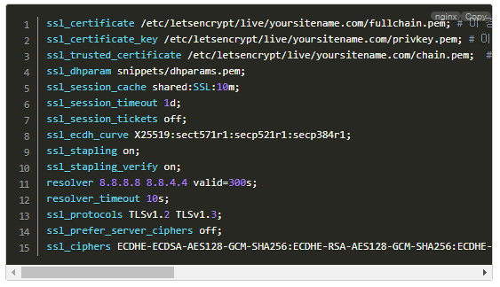

## 자신이 원하는 언어와 플러그인을 선택하고 CSS, JS 파일 다운 받기

지원하는 언어

<a href="https://prismjs.com/index.html#supported-languages" target="_blank" rel="noopener noreferrer">https://prismjs.com/index.html#supported-languages</a>

위 링크에서 원하는 언어를 살펴봅니다. 그리고 확장자를 꼭 살펴봅니다.

본인이 선택한 언어의 확장자를 모두 넣어줘야 되기 때문입니다.

---

<a href="https://prismjs.com/download.html#themes=prism-okaidia&languages=markup+css+clike+javascript" target="_blank" rel="noopener noreferrer">https://prismjs.com/download.html#themes=prism-okaidia&languages=markup+css+clike+javascript</a>

위 링크에 가서 원하는 언어와 플러그인을 모두 클릭합니다.

옆에 용량이 나와있으니 적당히 선택하는게 좋겠죠? ^^

그리고 제일 오른쪽 위에 보면 `THEME`를 선택할 수 있습니다.

선택해보고 제일 밑에 보시면 예제를 확인할 수 있습니다.

`SIR`도, 저도 `OKAIDIA` 테마를 선택했습니다.


플러그인은 `Copy to Clipboard Button` 추천합니다.

`Copy` 버튼을 만들어줍니다.


`Normalize Whitespace` 이건 필수입니다.

이게 없으면 첫번째 칸이 빈칸이 됩니다.


`Line Number` 플러그인은 라인의 번호를 앞에 표시해주는 것입니다. 원한다면 체크하세요. 이 플러그인은 추가 설정이 필요하니 잘 따라오세요!


다 선택했다면 밑에 `DOWNLOAD JS`, `DOWNLOAD CSS` 버튼을 누르고 prism.css 파일과 prism.js 파일을 다운 받습니다.

---

## 서버에 저장하기

### 아미나 

/plugin/apms 폴더에 prism 폴더를 생성 후 파일을 저장합니다.


### 나리야

/nariya/app 폴더에 prism 폴더를 생성 후 파일을 저장합니다.


위치는 마음대로 하셔도 상관없습니다. 설정하는 부분에서 원하는 곳을 바꾸면 됩니다.

---

## 아미나, 나리야 코어 수정하기

이 부분은 코어를 수정하는 방법 밖에 없더라구요.

가장 쉽지만 업데이트 할때마다 수고해야되는 단점이 있는게 함정입니다.


### 아미나

`/lib/apms.lib.php` 파일에서 3275번째 줄 근처

```php
	if($name == 'code') {
		if(!defined('APMS_CODE')) {
			define('APMS_CODE', true);
			add_stylesheet('<link rel="stylesheet" href="'.APMS_PLUGIN_URL.'/syntaxhighlighter/styles/shCoreEmacs.css">', -1);
			$code_script = '<script src="'.APMS_PLUGIN_URL.'/syntaxhighlighter/scripts/shCore.js"></script>'.PHP_EOL;
			$code_script .= '<script src="'.APMS_PLUGIN_URL.'/syntaxhighlighter/scripts/shBrushJScript.js"></script>'.PHP_EOL;
			$code_script .= '<script src="'.APMS_PLUGIN_URL.'/syntaxhighlighter/scripts/shBrushPhp.js"></script>'.PHP_EOL;
			$code_script .= '<script src="'.APMS_PLUGIN_URL.'/syntaxhighlighter/scripts/shBrushCss.js"></script>'.PHP_EOL;
			$code_script .= '<script src="'.APMS_PLUGIN_URL.'/syntaxhighlighter/scripts/shBrushXml.js"></script>'.PHP_EOL;
			$code_script .= '<script>var is_SyntaxHighlighter = true; SyntaxHighlighter.all(); </script>';
			add_javascript($code_script, 99);
		}
```

부분을 다 지우고

```php
	if($name == 'code') {
		if(!defined('APMS_CODE')) {
			define('APMS_CODE', true);
			add_stylesheet('<link rel="stylesheet" href="'.APMS_PLUGIN_URL.'/prism/prism.css">', -1);
			$code_script .= '<script src="'.APMS_PLUGIN_URL.'/prism/prism.js"></script>'.PHP_EOL;
			add_javascript($code_script, 99);
		}
```

위 내용으로 대체합니다.

파일 경로가 다르다면 맞게 수정하시면 됩니다.


대체한 뒤에 1776번째 줄을 보면 

```php
$brush_arr = array('css', 'js', 'jscript', 'javascript', 'php', 'xml', 'xhtml', 'xslt', 'html');
```

위 내용이 있는데, 1번에서 선택한 언어의 확장자를 모두 넣습니다. 


그리고 1781번째 줄을 보면

```php
return '<pre class="brush: '.$brush.';">'.$str.'</pre>'.PHP_EOL;
```

내용이 있는데

```php
return '<pre><code class="language-'.$brush.';">'.$str.'</code></pre>'.PHP_EOL;
```

위와 같이 대체합니다.


혹시 `Line Number` 플러그인을 선택해서 넣었다면

```php
return '<pre><code class="line-numbers language-'.$brush.';">'.$str.'</code></pre>'.PHP_EOL;
```

위와 같이 `class`에 넣어주면 됩니다. 그러면 라인에 번호가 생깁니다.

아미나는 파일 1개만 수정해주면 끝입니다. 


참 쉽죠? ^^


### 나리야

나리야는 파일 2개를 수정해야 합니다.

`/nariya/lib/core.lib.php` 파일에서 388번째 줄에

```php
} else if($id == 'code') {
	if(!defined('NA_CODE')) {
		define('NA_CODE', true);
            add_stylesheet('<link rel="stylesheet" href="'.NA_URL.'/app/syntaxhighlighter/styles/shCoreEmacs.css">', -1);
            $sh = '<script src="'.NA_URL.'/app/syntaxhighlighter/scripts/shCore.js"></script>'.PHP_EOL;
            $sh .= '<script src="'.NA_URL.'/app/syntaxhighlighter/scripts/shBrushJScript.js"></script>'.PHP_EOL;
            $sh .= '<script src="'.NA_URL.'/app/syntaxhighlighter/scripts/shBrushPhp.js"></script>'.PHP_EOL;
            $sh .= '<script src="'.NA_URL.'/app/syntaxhighlighter/scripts/shBrushCss.js"></script>'.PHP_EOL;
            $sh .= '<script src="'.NA_URL.'/app/syntaxhighlighter/scripts/shBrushXml.js"></script>'.PHP_EOL;
            $sh .= '<script>var is_SyntaxHighlighter = true; SyntaxHighlighter.all(); </script>';
            add_javascript($sh, 99);
```

위 내용을 전부 지우고

```php
} else if($id == 'code') {
	if(!defined('NA_CODE')) {
		define('NA_CODE', true);
            add_stylesheet('<link rel="stylesheet" href="'.NA_URL.'/app/prism/prism.css">', -1);
            $sh .= '<script src="'.NA_URL.'/app/prism/prism.js"></script>'.PHP_EOL;
            add_javascript($sh, 99);
```

위 내용으로 수정합니다.

파일 경로가 다르다면 맞게 수정하시면 됩니다.

---

이제 `두번째` 파일입니다.

`/nariya/lib/content.lib.php` 파일에서 313번째 줄

```php
$brush_arr = array('css', 'js', 'jscript', 'javascript', 'php', 'xml', 'xhtml', 'xslt', 'html');
```

위 내용에서 1번에서 추가한 언어의 확장자를 모조리 넣습니다. 


318번째 줄에

```php
return '<pre class="brush: '.$brush.';">'.$str.'</pre>'.PHP_EOL;
```

위 내용을

```php
return '<pre><code class="language-'.$brush.';">'.$str.'</code></pre>'.PHP_EOL;
```

위 내용으로 수정합니다.


혹시 `Line Number` 플러그인을 선택해서 넣었다면

```php
return '<pre><code class="line-numbers language-'.$brush.';">'.$str.'</code></pre>'.PHP_EOL;
```

위와 같이 class에 넣어주면 됩니다. 그러면 라인에 번호가 생깁니다.


나리야도 끝입니다.

참 쉽죠? ^^

---

## Code 블록 불러오는 방법

```
[code=css]
코드내용~~~
[/code]
```

위와 같이 기존에 code 대신에 code=css와 같이 원하는 언어의 확장자를 넣어주면 됩니다.

확장자를 넣지 않으면 기본 `HTML` 코드로 인식합니다.

---

## 에디터 사용시 줄바꿈이 2줄바꿈으로 되는 버그 해결 방법

특정 에디터에서는 한줄 띄울 때

`<p><br></p>` 이렇게 표현하는데요.

```php
$str = preg_replace("/(<br>|<br \/>|<br\/>|<p>)/i", "\n", $str);
$str = preg_replace("/(<div>|<\/div>|<\/p>)/i", "", $str);
```

위와 같이 변경될 때 `<p>`와 `<br>`이 둘다 줄바꿈이 이루어져 두줄이 줄바꿈됩니다.

해당 버그가 생겼을 때

```php
$str = preg_replace("/(<p>)/i", "\n", $str);
$str = preg_replace("/(<br>|<br \/>|<br\/>|<div>|<\/div>|<\/p>)/i", "", $str);
```

위와 같이 변경해주면 두줄바꿈이 해결됩니다.


아미나의 경우 `apms.lib.php`에서 대략 1768~1769번째 줄입니다.

나리야의 경우 `content.lib.php`에서 대략 305~306번째 줄입니다.